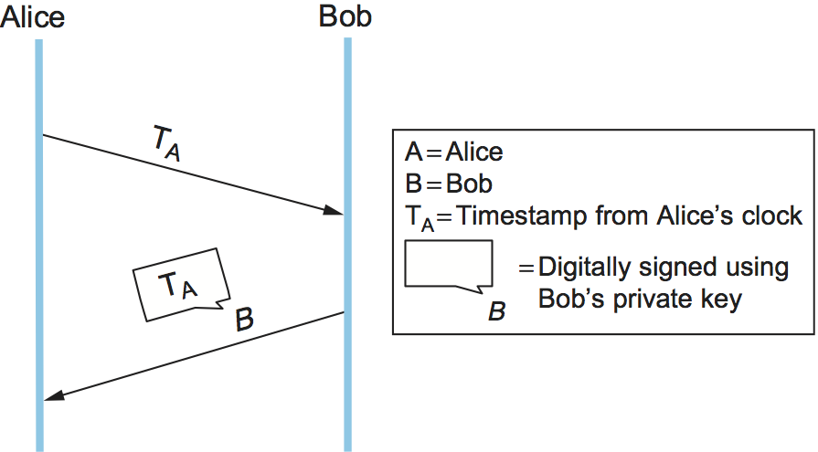
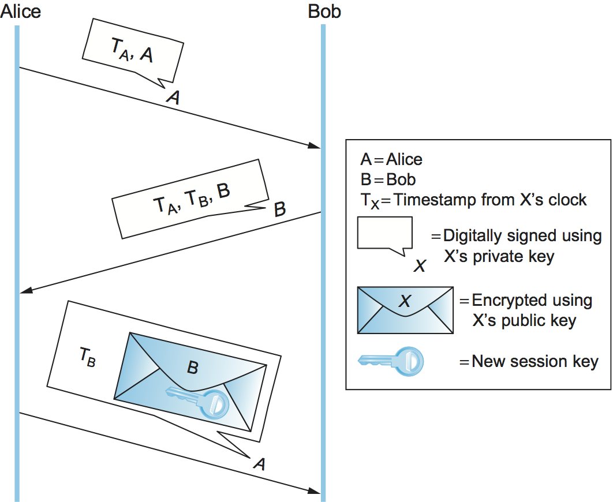

Chapter 5.  Authentication Protocols
=====================================

So far we described how to encrypt messages, build message
authentication codes, and distribute keys. It might seem
as if all we have to do to make a protocol secure is append an
authentication code to every message and, if we want confidentiality,
encrypt the message.

There are two main reasons why it’s not that simple. First, there is
the problem of a *replay attack*: an adversary retransmitting a copy
of a message that was previously sent. One could imagine, for example,
that a message in which you place an order for some item on a website
could be replayed, appearing to the website as though you had ordered
more of the same. Even though it wasn’t the original incarnation of
the message, its authentication code would still be valid; after all,
the message was created by you, and it wasn’t modified. Clearly, we
need a solution that ensures *freshness*.

In a variation of this attack called a *suppress-replay attack*, an
adversary might merely delay your message (by intercepting and later
replaying it), so that it is received at a time when it is no longer
appropriate. For example, an adversary could delay your order to buy
stock from an auspicious time to a time when you would not have wanted
to buy. Although this message would in a sense be fresh (it hasn't
been sent before), it
wouldn’t be timely. So we also need to ensure *timeliness*. Freshness
and timeliness may be considered aspects of integrity. Ensuring them
will in most cases require a nontrivial, back-and-forth protocol.

The second problem we have not yet solved is how to establish a session
key. A session key is a secret-key cipher key generated on the fly and
used for just one session. This too involves a nontrivial protocol.

What these two issues have in common is authentication. If a message is
not fresh and timely, then from a practical standpoint we want to
consider it as not being authentic, i.e., not being from whom it claims to be.
And, obviously, when you are arranging to share a new session key with
someone, you want to know you are sharing it with the right person.
Usually, authentication protocols establish a session key at the same
time, so that at the end of the protocol Alice and Bob have
authenticated each other and they have a new secret key to use. Without
a new session key, the protocol would just authenticate Alice and Bob at
one point in time; a session key allows them to efficiently authenticate
subsequent messages. Generally, session key establishment protocols
perform authentication. As we noted in the last chapter,
Diffie-Hellman key exchange in its simplest form does not provide
authentication, but in practical usage it is almost always combined
with an authentication protocol.

There is a core set of techniques used to ensure freshness and
timeliness in authentication protocols. We describe those techniques
before moving on to particular protocols.

5.1 Freshness and Timeliness Techniques
-------------------------------------------

We have seen that authentication codes alone do not enable us to detect
messages that are not fresh or timely. One approach is to include a
timestamp in the message. Obviously the timestamp itself must be
tamperproof, so it must be covered by the message authentication code. The primary
drawback to timestamps is that they require distributed clock
synchronization. Since our system would then depend on synchronization,
the clock synchronization itself would need to be defended against
security threats, in addition to the usual challenges of clock
synchronization. Another issue is that distributed clocks are
synchronized to only a certain degree—a certain margin of error. Thus,
the timing integrity provided by timestamps is only as good as the
degree of synchronization.

Another approach is to include a *nonce*—a random number used only
once—in the message. Participants can then detect replay attacks by
checking whether a nonce has been used previously. On its own, this
would require keeping track of past nonces, of which a great many could
accumulate.

A solution to the shortcomings of timestamps and nonces is to use one
or both of them in a *challenge-response* protocol. Suppose we use a
timestamp. In a challenge-response protocol, Alice sends Bob a
timestamp, challenging Bob to encrypt it in a response message (if
they share a secret key) or digitally sign it in a response message
(if Bob has a public key, as in :numref:`Figure %s
<fig-challenge-response>`). The encrypted timestamp is like an
authentication code that additionally proves timeliness. Alice can
easily check the timeliness of the timestamp in a response from Bob
since that timestamp comes from Alice’s own clock—no distributed clock
synchronization needed. Suppose instead that the protocol uses
nonces. Then Alice need only keep track of those nonces for which
responses are currently outstanding and haven’t been outstanding too
long; any purported response with an unrecognized nonce must be bogus.

.. _fig-challenge-response:

   A challenge-response protocol.

The beauty of challenge-response is that it combines timeliness and
authentication; after all, only Bob (and possibly Alice, if it’s a
secret-key cipher) knows the key necessary to encrypt the
never-before-seen timestamp or nonce.  Timestamps or nonces are used
in most of the authentication protocols that follow.

5.2 Public-Key Authentication Protocols
-----------------------------------------

In the following discussion, we assume that Alice and Bob’s public
keys have been predistributed to each other via some means as
described in the previous chapter. This could include the case where
Alice includes her certificate in her first message to Bob, and the
case where Bob searches some sort of public key infrastructure for a
certificate about Alice when he receives her first message.

We describe here a simple authentication protocol that uses
timestamps, illustrated in :numref:`Figure %s <fig-pKAuthNoSync>`. In
this protocol, Alice sends Bob a digitally signed message with a
timestamp from her local clock and her identity.  Because their clocks
aren’t synchronized, Bob cannot be sure that the message is fresh. Bob
sends back a digitally signed message with Alice’s original timestamp,
his own locally generated timestamp, and his identity. Alice can verify the
freshness of Bob’s reply by comparing her current time against the
timestamp that originated with her. She then sends Bob a digitally
signed message with his original timestamp and a new session key
encrypted using Bob’s public key. Bob can verify the freshness of the
message because the timestamp came from his clock, so he knows he can
trust the new session key.

The timestamps in this example essentially serve as convenient nonces, and indeed this
protocol could use nonces instead. We will see some examples of this
when we look at Transport Layer Security (TLS) in a later chapter.

.. _fig-pKAuthNoSync:

   A public-key authentication protocol. Alice checks her own
   timestamp, signed by Bob, against her own clock,
   and Bob does the same with his timestamp signed by Alice.

5.3 Secret-Key Authentication Protocols
-----------------------------------------

Only in fairly small systems is it practical to predistribute secret
keys to every pair of entities. We focus here on larger systems, where
each entity would have its own *master key* shared only with a Key
Distribution Center (KDC). In this case, secret-key-based authentication
protocols involve three parties: Alice, Bob, and a KDC. The end product
of the authentication protocol is a session key shared between Alice and
Bob that they will use to communicate directly, without involving the
KDC.

.. _fig-needhamSchroeder:
.. figure:: figures/f08-10-9780123850591.png
   :width: 500px
   :align: center

   The Needham-Schroeder authentication protocol.

The Needham-Schroeder authentication protocol formed the basis for
many future authentication systems, and is illustrated in
:numref:`Figure %s <fig-needhamSchroeder>`. Note that the KDC doesn’t
actually authenticate Alice’s initial message and doesn’t communicate
with Bob at all. Instead, the KDC uses its knowledge of Alice’s and
Bob’s master keys to construct a reply that would be useless to anyone
other than Alice (because only Alice can decrypt it) and contains the
necessary ingredients for Alice and Bob to perform the rest of the
authentication protocol themselves.

The process begins with Alice sending a message to the KDC that
includes a nonce and the names of the two principals, A(lice) and
B(ob). The KDC responds by creating a new session key, encrypting that
with the key that the KDC shares with Bob (indicated by the small,
inner envelope), and including that in a message sent back to Alice.
This message is in turn encrypted using the key that is shared by the
KDC and Alice (as indicated by the outer envelope). Thus, only Alice
can decrypt this message, and now she has both the unencrypted session
key and an encrypted copy of the session key to send to Bob. On receiving
the message from Alice, Bob is able to decrypt it and obtain the
session key. He now creates another nonce and encrypts it with the
session key and replies to Alice. Finally, Alice decrypts the nonce,
increments it, and replies to Bob with the encrypted result, proving
that she has seen the nonce.  Although the nonce created by Bob and
used in the last two messages shows that the final message from Alice
is fresh, it does not guarantee freshness of the initial message Bob
received from Alice at step 3. Kerberos addresses this shortcoming.

5.3.1 Kerberos
~~~~~~~~~~~~~~~~

Kerberos is an authentication system based on the Needham-Schroeder
protocol and specialized for client/server environments. Originally
developed at MIT, it has been standardized by the IETF and is available
as both open source and commercial products. We focus here on some
of Kerberos’s interesting innovations. Notably, it addresses the
freshness problem identified in Needham-Schroeder by using timestamps
rather than nonces.

Kerberos clients are generally human users, and users authenticate
themselves using passwords. Alice’s master key, shared with the KDC,
is derived from her password—if you know the password, you can compute
the key. Kerberos assumes anyone can physically access any client
machine; therefore, it is important to minimize the exposure of
Alice’s password or master key not just in the network but also on any
machine where she logs in. Kerberos takes advantage of an approach
derived from Needham-Schroeder to accomplish this. In
Needham-Schroeder, the only time Alice needs to use her password to
access her master key is when decrypting the reply from the
KDC. Kerberos client-side software waits until the KDC’s reply
arrives, prompts Alice to enter her password, computes the master key
and decrypts the KDC’s reply, and then erases all information about
the password and master key to minimize its exposure. Also note that
the only sign a user sees of Kerberos is when the user is prompted for
a password.

In Needham-Schroeder, the KDC’s reply to Alice plays two roles: It
gives her the means to prove her identity (only Alice can decrypt the
reply), and it gives her a sort of secret-key certificate or “ticket”
to present to Bob—the session key and Alice’s identifier, encrypted
with Bob’s master key. In Kerberos, those two functions—and the KDC
itself, in effect—are split up (:numref:`Figure %s <fig-kerberos>`). A
trusted server called an Authentication Server (AS) plays the first
KDC role of providing Alice with something she can use to prove her
identity—not to Bob this time, but to a second trusted server called a
Ticket Granting Server (TGS). The TGS plays the second KDC role,
replying to Alice with a ticket she can present to Bob. The attraction
of this scheme is that if Alice needs to communicate with several
servers, not just Bob, then she can get tickets for each of them from
the TGS without going back to the AS.

.. _fig-kerberos:
.. figure:: figures/f08-11-9780123850591.png
   :width: 600px
   :align: center

   Kerberos authentication.

Once Alice has received the ticket from the AS, she is able to
communicate with the TGS. She provides the ticket, the identifier for
Bob, and an encrypted timestamp (in place of the nonce used in
Needham-Schroeder). The TGS replies with a ticket that will be
readable by Bob, because it is encrypted with his master key, and a
session key that is encrypted using the key shared by Alice and the
TGS. Alice can now start communicating with Bob, sending the ticket
and another encrypted timestamp using the newly provided session key.

In the client/server application domain for which Kerberos is
intended, it is reasonable to assume a degree of clock
synchronization. This allows Kerberos to use timestamps and lifespans
instead of Needham-Shroeder’s nonces. This means that the TGS and Bob
can both be assured that the messages that came from Alice are fresh
and not replays, thereby eliminating the Needham-Schroeder security
weakness noted above. The freshness of Bob's reply to Alice is assured
because it is a response to the challenge from Alice.

Kerberos has undergone considerable development and standardization over
the decades. It supports a choice of hash functions and secret-key
ciphers, which has allowed it to evolve along with the standards for
cryptographic algorithms.
