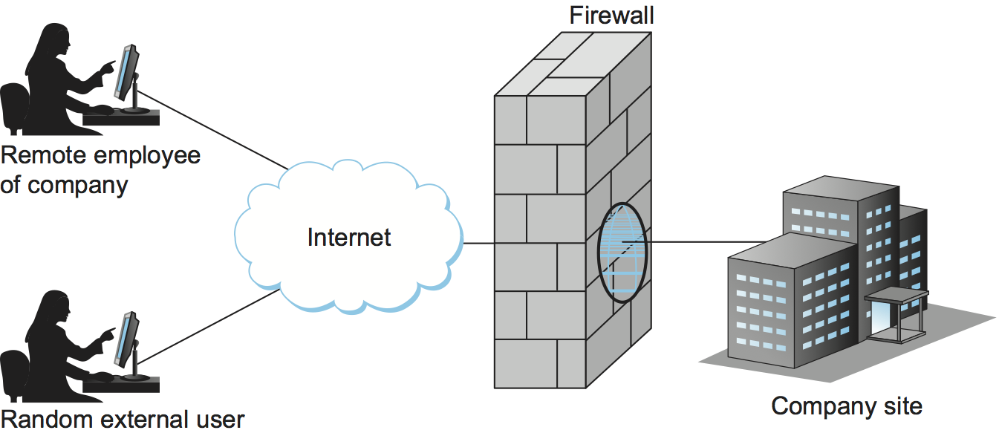

Chapter 9. Firewalls
====================

Whereas much of this book has focused on the uses of cryptography to
provide such security features as authentication and confidentiality,
there is a whole set of security issues that are not readily addressed
by cryptographic means. For example, worms, viruses and other malware spread by
exploiting bugs in operating systems and application programs (and
sometimes human gullibility as well);  no amount of cryptography can
help you if your machine has unpatched vulnerabilities. So other
approaches are often used to keep out various forms of potentially
harmful traffic. Firewalls are one of the most common ways to do this.

9.1 Basic Principles of Firewalls
-----------------------------------

The historical meaning of a firewall is a barrier to prevent the
spread of fire from one part of a building to another. Firewalls are also
present in many automotive vehicles to separate passengers from the
noisy (and possibly fire-prone) engine compartment. Saltzer and
Schroeder in 1975 applied the term, possibly for the first time in
the context of computer security, when discussing least privilege.

A network firewall is a system that typically sits between two regions
of a network, as illustrated in :numref:`Figure %s <fig-firewall>`,
protecting the flow of traffic from one region to another. A common
location would be a strategic point such as the ingress/egress point
to an enterprise network or data center. Of course, unlike a physical
firewall that blocks everything in its path, a network firewall is
really a sort of packet filter that makes decisions about exactly what
traffic is allowed to pass through it.

Historically, a firewall has been implemented as an “appliance”: a
dedicated system with one job, filtering packets. Firewalls have also
been provided as a set of features available on a router, and a
“personal firewall” may be implemented on an end-user machine. More
recently (in the last decade or so), *distributed firewalls* have
appeared in an effort to apply security policies to a greater amount
of traffic. We return to this class of firewall later in the chapter.

Firewall-based security depends on the firewall being at some sort of
choke-point. There should be no way to bypass the firewall via other
gateways, or alternate paths such as wireless connections or dial-up
connections. While the job of a firewall is to block potentially harmful traffic
("fire") for some definition of "harmful", a great deal of traffic passes through a firewall. One
common setting for a firewall is "default closed": by default it
blocks traffic unless that traffic is specifically allowed to pass
through. For example, it might filter out all incoming messages except
those addressed to a particular set of IP addresses and to particular
TCP port numbers. Given the complexity of the environments where
firewalls are used, with perhaps thousands of IP addresses and
hundreds of applications in use, the configuration of firewalls also
often becomes complex.

.. _fig-firewall:

   A firewall filters packets flowing between a site and the rest of the
   Internet.

When deployed at an ingress/egress point, a firewall divides a network
into a more-trusted zone on one side of the firewall (the "inside")
and a less-trusted zone that is "external" to the firewall. This is
useful if, for example, you do not want external users to access a particular host
or service within your site. Much of the complexity comes from the
fact that you want to allow different kinds of access to different
external users, ranging from the general public, to business partners,
to remotely located members of your organization. A firewall may also
impose restrictions on outgoing traffic to prevent certain attacks and
to limit losses if an adversary succeeds in getting access inside the
firewall (or to limit the damage of insider attacks).

The location of a firewall often happens to also be the dividing line
between globally addressable regions and those that use local
addresses. Hence, Network Address Translation (NAT) functionality and
firewall functionality often are found in the same device, even though
they are logically separate.

While the example above suggests a trusted and an untrusted network,
firewalls are often used to create multiple *zones of trust*, such as a
hierarchy of increasingly trusted zones. A common arrangement involves
three zones of trust: the internal network, the *DMZ* (“demilitarized
zone”); and the rest of the Internet. The DMZ is used to hold services
such as DNS and email servers that need to be accessible to the outside.
Both the internal network and the outside world can access the DMZ, but
hosts in the DMZ cannot access the internal network; therefore, an
adversary who succeeds in compromising a host in the exposed DMZ still
cannot access the internal network. The DMZ can be periodically restored
to a clean state.

Firewalls filter traffic based on information that can be found in the
packets passing through them. This is likely to include such fields as
IP addresses, the TCP or UDP port numbers, and so on. They are
configured with a table of values in these fields that characterize
the packets they will, and will not, forward.  Generally, each entry
in the table is a 4-tuple or 5-tuple: It gives the IP address and TCP (or UDP)
port number for both the source and destination (four fields), and it
may also include the specific value of the layer 4 protocol (TCP, UDP, etc.).

For example, a firewall might be configured to filter out (not forward)
all packets that match the following description:

.. code:: c

   (198.51.100.14, 1234, 192.0.2.11, 80, TCP)

This pattern says to discard all TCP packets from port 1234 on host
198.51.100.14 addressed to port 80 on host 192.0.2.11. (Port 80 is the
well-known TCP port for HTTP.) Of course, it’s often not practical to
name every source host whose packets you want to filter, so the patterns
can include wildcards. For example,

.. code:: c

   (*,  *, 192.0.2.11, 80, TCP)

says to filter out all packets addressed to port 80 on 192.0.2.11,
regardless of what source host or port sent the packet. Notice that
address patterns like these require the firewall to make
forwarding/filtering decisions based on level 4 port numbers, in
addition to level 3 host addresses. For this reason, network
layer firewalls are sometimes called *level 4 switches*.

Linux has a firewall feature called ``ufw`` (uncomplicated firewall)
that can apply firewall rules on a host. We can implement the policy
described above with the following command:

.. code:: c

    $ sudo ufw deny to 192.0.2.11 port 80
    rule added
    $

Then we can check that our rule was applied correctly:

.. code:: c

    $ sudo ufw status
    Status: active

    To                         Action      From
    --                         ------      ----
    192.0.2.11 80              DENY        Anywhere

    $

In the preceding discussion, the firewall forwards everything except
where specifically instructed to filter out certain kinds of packets. A
firewall could also filter out everything unless explicitly instructed
to forward it, or use a mix of the two strategies. For example, instead
of blocking access to port 80 on host 192.0.2.11, the firewall might be
instructed block everything except access to port 25 (the SMTP mail port) on a
particular mail server, such as

.. code:: c

   (*,  *, 198.51.100.9, 25)

We can specify this behavior with ufw:

.. code::

    $ sudo ufw default deny incoming
    Default incoming policy changed to 'deny'
    (be sure to update your rules accordingly)
    $ sudo ufw allow to 198.51.100.9 port 25
    rule added
    $ sudo ufw status
    Status: active

    To                         Action      From
    --                         ------      ----
    198.51.100.9 25            ALLOW       Anywhere

Experience has shown that firewalls are very frequently configured
incorrectly, allowing unsafe access, or breaking applications that
need access. Part of the problem is that filtering rules can overlap
in complex ways, making it hard for a system administrator to
correctly express the intended filtering. A design principle that we
discussed in Chapter 2 comes into play here: fail-safe defaults. The
application of that principle to firewalls says they should, by
default, discard all packets other than those that are explicitly
allowed. Of course, this means that some valid applications might be
accidentally disabled; the typical approach is that users of those
applications eventually notice the breakage and ask the system
administrator to make the appropriate change.

Many client/server applications dynamically assign a port to the client.
If a client inside a firewall initiates access to an external server,
the server’s response would be addressed to the dynamically assigned
port. This poses a problem: how can a firewall be configured to allow an
arbitrary server’s response packet but disallow a similar packet for
which there was no client request? This is not possible with a
*stateless firewall*, which evaluates each packet in isolation. It
requires a *stateful firewall*, which keeps track of the state of each
connection. An incoming packet addressed to a dynamically assigned port
would then be allowed only if it is a valid response in the current
state of a connection on that port.

Modern firewalls also understand and filter based on many specific
application-level protocols such as HTTP or FTP. They use
information specific to that protocol, such as URLs in the case of HTTP,
to decide whether to discard a message. When firewalls are able to
inspect payloads that are inside the TCP header (for example, to parse
an HTTP request), this is referred to as *deep packet inspection*
(DPI). Of course, DPI can be a challenge if end-to-end encryption is used.

A particular type of firewall that can interpret application traffic
is the *Web Application Firewall*. Such firewalls are often placed
directly in front of servers delivering web applications (or are
implemented as a module within the server). They inspect the
application traffic and apply filtering rules to identify and block
specific attacks that target known vulnerabilities, such as SQL
injection. When TLS is in use (as it invariably is in the modern web),
web application firewalls terminate the HTTPS connection so that the
application payload can be inspected. The open source ModSecurity
project is a widely-used example of a web application firewall.

9.2 Strengths and Weaknesses of Firewalls
-----------------------------------------

At best, a firewall protects a network from undesired access from the
rest of the Internet; it cannot provide security to legitimate
communication between the inside and the outside of the firewall. In
contrast, the cryptography-based security mechanisms described in this
chapter are capable of providing secure communication between any
participants anywhere. This being the case, why are firewalls so common?
One reason is that firewalls can be deployed unilaterally (by a
network administrator, for example), using individual
commercial products, while cryptography-based security requires support
at both endpoints of the communication. A more fundamental reason for
the dominance of firewalls is that they encapsulate security in a
centralized place, in effect factoring security out of the rest of the
network. A system administrator can manage the firewall to provide
security, freeing the users and applications inside the firewall from
security concerns—at least some kinds of security concerns. And as
noted at the start of the chapter, encryption and authentication offer
limited protection against exploitation of bugs in the operating
systems of hosts.

Unfortunately, firewalls have serious limitations. Since a firewall does
not restrict communication between hosts that are on the same side of the firewall,
the adversary who does manage to gain access to one host at a site
potentially has access to
all local hosts. How might an adversary gain access inside the firewall? The
adversary could be a disgruntled employee with legitimate access, or the
adversary’s software could be hidden in some software installed from a
USB drive or downloaded from the Web. It might be possible to bypass the
firewall by using a VPN—this has proven to be a common form of attack
in recent years.

A related problem is that any parties granted access through your
firewall, such as business partners or externally located employees,
become a security vulnerability. If their security is not as good as
yours, then an adversary could penetrate your security by penetrating
their security.

While part of the motivation for firewalls is to protect machines that
may have vulnerabilities from attack, their ability to do so is
limited. If, for example, an attacker is able to gain access to a
machine inside the firewall via one of the methods mentioned above,
they may then be able to connect to another machine inside the
firewall that contains an unpatched vulnerability, even though that
machine itself is not directly accessible through the firewall.
System administrators are expected to monitor for new vulnerabilities
and patch them, but there is always a chance the vulnerabilities
appear faster than then can be remediated. While staying up to date
with patches is a best practice, it is certainly not one that is
followed uniformly.

In Chapter 1 we discussed the threat posed by viruses, worms, and the
general category of malware. While firewalls aim to stop the spread
of malware, it can be a difficult task, since many operations that the
firewall needs to permit, such as web browsing or email delivery, can
also be used for the delivery of malware.

One approach that is used to detect malware is to search for segments of
code from known malware, sometimes called a *signature*. This approach
has its own challenges, as cleverly designed malware can tweak its
representation in various ways. There is also a potential impact on
network performance to perform such detailed inspection of data entering
a network.

Some of the limitations of firewalls are related to the assumption
that all traffic has to be funneled through a single appliance (or a
small number of them). This leads to challenges both in performance,
since so much traffic passes through a single choke point, and in
effectiveness, since there can be plenty of traffic within an
enterprise or a data center that has no need to pass through such a
choke point. These limitations have led to the development of
*distributed firewalls*, which we discuss in the following section.

9.3 Distributed Firewalls
-------------------------

A conventional firewall is implemented as a *choke point:* the network
is set up in such a way that traffic must pass through the firewall to
get from one part of the network to another. It is common to talk
about devices as being "inside" or "outside" the firewall based on
which side of that choke point they sit on. There are two implications
of such an approach. One is that any devices that sit on the same side
of the firewall are free to communicate with each other uninterrupted
by the firewall. The second is that there must be an impenetrable
barrier around the devices that are "inside" the firewall, with the
firewall being the only way to get through that barrier. This seems
appealing if you are trying to secure, say, the machines inside a
single building, with only one connection to the outside world, but it
becomes a lot less attractive if we are talking about securing all the
machines in a complex enterprise spread across many sites. Even in
simple cases, people find ways around a firewall. Once upon a time you
might have to worry about an unsanctioned dial-up connection bypassing
a firewall, while wireless networks and users at the ends of VPN
tunnels are a bigger issue in contemporary settings. In any case, the
concept of an impenetrable perimeter can be very difficult to sustain
in practice.

The fact that a perimeter firewall does not filter traffic between
machines on the same side of the firewall has enabled a set of attacks
that make use of *lateral movement*. The core idea is that an attacker
obtains a foothold in one system *inside* the firewall and then uses
that as a base of operations to move around to the ultimate
target. The initial system that the attacker breaches may not be particularly
important. Perhaps he gains access via a phishing attack or by leveraging a
vulnerability in the OS. But at this point the firewall is of no use,
and the attacker can start trying to find ways to move from one system
to another inside the firewall, until eventually he has access to a
machine of interest, such as one holding sensitive data. These types
of lateral movement attacks are extremely common and have been well
documented, often lasting for months before they are detected.

The obvious solution to problems of lateral movement would seem to be
internal firewalls. However, such a solution raises a new set of
challenges. Consider the example in :numref:`Figure %s
<fig-dc-firewall>`, in which a single firewall has been deployed to
filter traffic flows among a set of virtual machines in a datacenter.

Suppose that traffic sent from VM A to VM C needs to be processed at
the firewall. To ensure it is filtered, traffic needs to be routed
over a path that traverses the firewall, not necessarily the shortest
path from A to C. In the more extreme case of traffic from VM A to VM
B, the two VMs sit on the same host, so the traffic from A to B needs to be
sent out of the host, across the network to the firewall, and then
back to B. This is clearly not efficient, and consumes resources both
within the network and at the network interface for the hairpinned
traffic. Furthermore, the firewall itself has the potential to become
a bottleneck, as all traffic requiring filtering must pass through to that
centralized device.

Finally, there is considerable management overhead in supporting such
an internal firewall. Assume that we start with some sensible
default policies that deny all traffic flows aside from those
explicitly allowed. Each new application that is deployed will require
some new firewall rule to be created to allow traffic to flow between
the component machines for that application. If a VM is moved, we may
need to update the routing and the firewall rules to ensure that
traffic continues to be filtered correctly. All of these concerns have
led to internal firewalls being used rather sparingly.

.. _fig-dc-firewall:
.. figure:: figures/Slide47.png
   :width: 600px
   :align: center

   A single firewall in a virtualized datacenter.

The solution to the many issues with internal firewalls appeared as
one of the features of network virtualization, the distributed
firewall. :numref:`Figure %s <fig-dist-firewall>` illustrates a
distributed firewall implementation. In this case, traffic sent from
VM A to VM C can be processed by a firewall function at either (or
both) of the virtual switches that it traverses, and still be sent
over the shortest path through the network underlay between the two
hosts, without hairpinning to a centralized firewall. Furthermore,
traffic from VM A to VM B need never even leave the host on which
those two VMs reside, passing only through the virtual switch on that
host to receive the necessary firewall treatment.

A significant side effect of distributing a service in this way is
that there is no longer a central bottleneck. Every time another
server is added to host some more VMs, there is a new virtual switch
with capacity to do some amount of distributed processing. This means
it is relatively simple to scale out the amount of firewalling in this
way.

.. _fig-dist-firewall:
.. figure:: figures/Slide48.png
   :width: 600px
   :align: center

   A distributed firewall is implemented as part of the virtual
   switch in every host in a datacenter.

A detail that we have glossed over up to this point is that the
distributed firewall needs to be configured somehow. It would be
intractable to configure firewall policies in every single virtual
switch throughout a data center. This is why distributed firewalls
appeared as a feature of software-defined networks. The SDN controller
provides a central point of administrative control for firewall
policies, while the implementation of filtering rules is distributed
out to the virtual switches. Thus, for example, a rule that specifies
how traffic from VM A to VM B should be filtered can be expressed to
the SDN controller, which then calculates how to create the low level
filtering rules to push out to the appropriate virtual switches. The
SDN controller can also take account of such events as the migration
of a VM from one location to another, or the addition of a new VM that
requires additional firewall rules to be installed.

For further details on network virtualization and distributed services
we recommend our companion book on software-defined networks.

.. admonition:: Further Reading

   L. Peterson, C. Cascone, B. O’Connor, T. Vachuska,
      and B. Davie. `Software-Defined Networks: A Systems
      Approach <https://sdn.systemsapproach.org>`__.

9.4 Security Appliances
------------------------------

Firewalls are often placed inside a larger category of *security
appliances*—devices placed at some strategic point in the network to
perform a security function. Such appliances generally watch for and
respond to unwanted traffic, where the main challenge is how to
distinguish between good and bad traffic. This section looks at two
examples.

9.4.1 Intrusion Detection and Prevention
~~~~~~~~~~~~~~~~~~~~~~~~~~~~~~~~~~~~~~~~~~~

A common example of a security appliance is an *intrusion detection
system* (IDS), or its sibling *intrusion prevention system* (IPS).
These systems look for anomalous activity, such as an unusually
large amount of traffic targeting a particular port number, which
often signals a malicious attempt to probe for a vulnerability. When
identified, the appliance either generates an alarm for network
managers, or in some cases, is able to take immediate action to limit
the damage.

A good example of an IPS is Snort, an open source project first
published in 1999, having started life as an IDS, and now owned by
Cisco. In its original incarnation, Snort provided a lightweight,
rule-based packet filtering and capture tool based on Berkeley Packet
Filters. The idea is that attacks, such as worms, have a recognizable
signature, and that the IDS can be programmed with a rule to recognize
the attack traffic, and raise alerts when this happens. As an IPS,
Snort now takes the additional step of blocking the attack.

.. admonition:: Further Reading

   `Snort: Open Source Intrusion Prevention System (IPS)
   <https://snort.org/>`__.

Like firewalls, IDS and IPS need to see all the traffic traversing a
network if they are to detect attacks, and so strategic placement is
important. That leads to the same concerns about east-west traffic
that we discussed above, and thus there are also distributed versions
of these systems.

For an IDS/IPS that uses packet signatures to be effective, the set of
potential attacks need to have been spotted in the wild and analyzed
so that suitable rules can be formulated. Sharing rules among a
community of users helps to speed up this process, and commercial
IDS/IPS systems typically come with a subscription to a
frequently-updated rules database. (See the Snort website referenced
above for an example set of community rules.)

.. sidebar::  Identifying Unwanted Traffic

  *Our overview of security appliances could lead to the conclusion
  that decisions about whether traffic is legitimate or malicious is
  clear cut.  It often is not, and there can be real consequences in
  both directions.  For example, an overly aggressive IPS rule-set or
  anomoly detection heuristic could raise false positives, restricting
  legimate traffic and negatively impacting revenue. Too conservative,
  and malilcous traffic could crowd out legitimate traffic.*

  *It is also the case that that "unwanted" is in the eye of the
  beholder.  Network probes that are sometimes used in research, with
  the ultimate goal of improving the Internet in some way, are often
  flagged as malicious. Even a single unexpected UDP packet can
  trigger a cease-and-desist letter. In other situations,
  administrators want to ensure that a human (and not an automated
  crawler) is sending requests to their websites. There are "opt-out"
  conventions (e.g., adding a ``robots.txt`` file), but they depend on
  the good will of other actors. Some website administrators are now
  using Anubis, an open source web application firewall, to ensure that
  a human, and not an AI bot
  trying to scrape their content, is at other end of every HTTP request.*

Another approach to using signatures is to look for
*anomalies*—patterns in the behavior of traffic that somehow stand out
from "normal" and can be categorized as a potential attack. Clearly
this approach is attractive in that novel attacks can be detected
before they make it into a rule database. The hard part is achieving
high detection accuracy. Anomaly detection typically relies on machine
learning algorithms to classify traffic as "normal" or
"anomalous". Because both signature-based and anomaly-based detection
have their respective strengths and weaknesses, it is common to find
both approaches used in modern IDS/IPS systems.

The proliferation of security appliances brings us back to one the
security principles discussed in Chapter 2: defense in depth. For
example, if we had a perfect firewall, we might not require an IDS or
IPS. However, knowing that firewalls will never block all forms of
malicious traffic leads to the conclusion that an IDS/IPS is worth
having as a second line of defense.

9.4.2 DoS Mitigation
~~~~~~~~~~~~~~~~~~~~~~~~~~~

Sometimes unwanted traffic is simply trying to consume resources,
rather than exploit a vulnerability. Such attacks—or as they are
commonly known, *Denial of Service (DoS)* attacks—threaten
availability (as opposed to confidentiality or integrity). They
typically involve an adversary trying to overwhelm "good" resources
(link bandwidth, packet forwarding rates, server response throughput)
with traffic generated by "bad" resources (botnets constructed from a
distributed collection of compromised devices). Firewalls and other
security appliances help protect devices from being compromised in the
first place, but because they are not perfect (a human is usually the
weakest link), we also need ways to mitigate the impact of
*Distributed DoS (DDoS)* attacks.

Keeping in mind that DDoS traffic typically looks legitimate (there's
just too much of it), the DDoS challenge is addressed by two general
countermeasures. Note that the best we can hope for is to mitigate the
impact of such attacks; there is no cure-all. This is easy to
understand at an intuitive level: an appliance defending against DoS
attacks is itself a kind of resource that can be DoS'ed.

The first countermeasure is to absorb potential attacks with even
greater resources than the adversary is able to muster. For web
content, this is done using the same mechanism as is used to absorb
flash crowds of legitimate traffic: a *Content Distribution Network
(CDN).* The idea is to replicate content (whether it's a movie or a
critical piece of infrastructure metadata) across many
widely-distributed servers. As long as the aggregate capacity of these
servers is greater than the aggregate capacity of the botnet, content
remains available. This notion of *aggregate* capacity generalizes
beyond web servers responding to GET requests. A network is itself a
distributed collection of forwarding and transmission resources,
engineered to distribute those resources in a way that avoids
vulnerable bottlenecks.

The second countermeasure is to filter malicious traffic as early
(close to the source) as possible. This is similar to what an IPS
would do, except the traffic often looks legitimate. If a DoS attack
comes from a single source, then it is easy to "block" traffic from
that source at an ingress to a network you control. This is why DoS
attacks are typically distributed.  Dropping (or rate limiting) attack
packets at the boundary router (or firewall) for an enterprise is
better than allowing those packets to flood the local network and
reach a victim server(s), but the more widely distributed the periphery
of your network, the earlier you can filter malicious packets. And
drawing on the first countermeasure, the more widely distributed your
network resources are, the greater your aggregate filtering capacity.
Global overlay networks, as provided by companies like Cloudflare and
Fastly, offer a combination of content distribution and distributed
packet filtering.  These are commercial products, with many
proprietary details, but the general principles outlined here explain
their underlying strategy.

