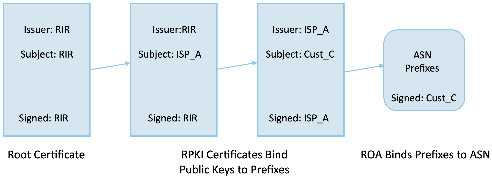
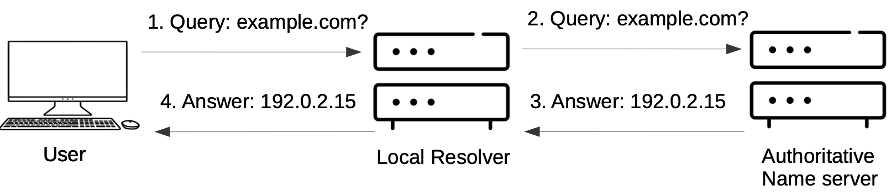
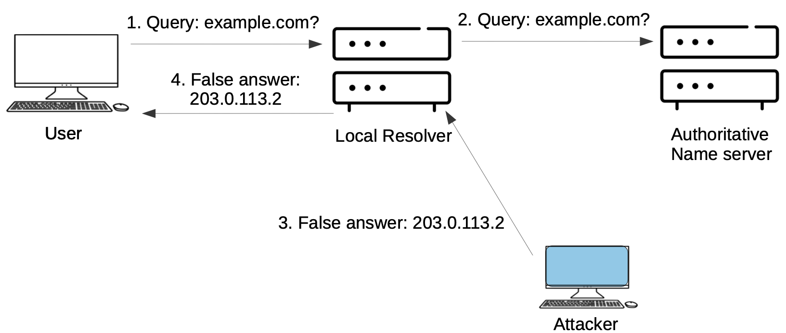
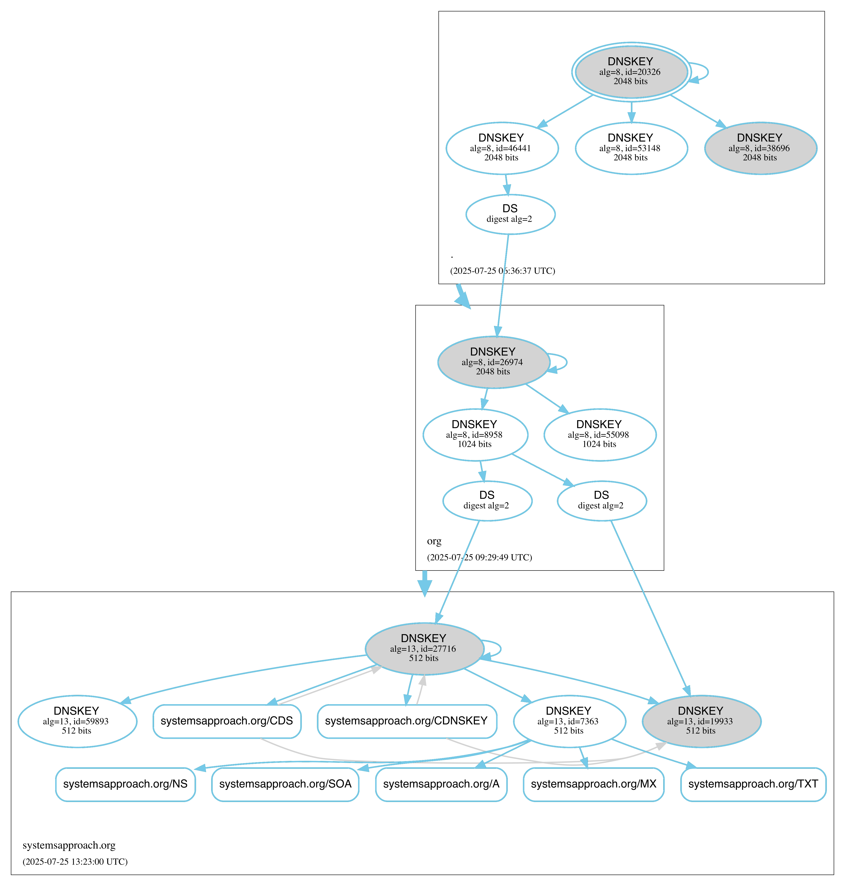

Chapter 8.  Infrastructure Security
==============================================

In the preceding chapters we have focused on the security of
end-systems connected to the Internet and on securing communication
between parties as their traffic traverses the Internet. But the
Internet itself consists of infrastructure, such as routers, that must
also be defended against attacks. Two areas of particular concern are
the interdomain routing system and the domain name system (DNS). Both
systems routinely come under attack. They are also complex distributed
systems. While distributing the routing and naming functions helps
make these systems resilient to failure, many opportunities for attack
exist. In this chapter we discuss some of the ongoing
efforts to improve their resistance to attacks. [#]_

The following discussion builds on some of the concepts introduced in previous
chapters. Notably, the concept of public key infrastructure (PKI),
which we introduced in Chapter 4 and which underpins the operation of TLS,
plays an important role in securing infrastructure as well. While the
principles of certificates and chains of trust apply in any PKI, the
specifics of how certificates are distributed and what they refer to
are different in each application. We describe the different
approaches to PKI for infrastructure services in the following sections.

Availability of infrastructure, including resistance to
denial-of-service (DoS) attacks, is clearly important to the operation
of the Internet. Mitigation of such attacks is increasingly handled by
distributed infrastructure like content distribution networks (CDNs),
as we discuss in the final section of this chapter.

.. [#] Many thanks to Cecilia Testart for her contributions to this
       chapter, particularly the BGP and Routing Security sections.

8.1 BGP and Routing Security
----------------------------

In most respects, a router is just a special-purpose computer with
some high-speed interfaces and specialized software to perform tasks
such as route computation and advertisement. So routers need to be
protected like end-systems, e.g., with strong passwords and
multi-factor authentication, using access control lists and firewalls,
etc.  That is only a starting point, however, because the actual
routing protocols themselves introduce opportunities for attack. BGP,
the Border Gateway Protocol, is vulnerable to a wide range of
attacks, and is the only routing protocol that is expected to cross the
boundaries of a single administrative domain, so we focus our
attention here.

The primary challenge in securing the Internet's routing
infrastructure boils down to this: how can you trust a routing
announcement received via BGP? At first glance, this looks similar to
the problem solved by TLS: how do we know that we're talking to the
web site we wanted to connect to? But there are multiple levels to
this problem when it comes to inter-domain routing.  When you have a
secure, encrypted connection to your bank, you probably trust them to
show you accurate information about your account (mostly—banks do make
mistakes on occasions) and the secure connection protects it from
modification by an attacker. A secure, encrypted connection to the
website of the New York Times, however, doesn't mean you should
believe every word published by the New York Times. Similarly, a
secure connection to a BGP speaker (a router running BGP) doesn't
imply that every route advertisement provided by that speaker is
reliable. We need to look a bit more closely at how BGP works to see
where the challenges lie.

BGP speakers advertise *paths* to reach *prefixes*. When a BGP speaker
receives a set of path advertisements from its peers, it runs a route
selection process to determine its preferred path to any prefix, using
a large and flexible set of criteria to decide which path to
select. The business relationships among providers play a central role
in path selection. While a router might prefer a path to a given
prefix that is shorter (as measured by the number of autonomous
systems it contains) to one that is longer, that is not a hard rule
(unlike intra-domain routing). The business relationships among the
different service providers and customers play a central role in the
ultimate choice of path. When a BGP speaker has chosen a path to reach
a particular prefix, it may choose to re-advertise that path to other
BGP speakers, either in the same AS or in another AS. Again, this
depends on customer-provider relationships. For a more full discussion
of how BGP works, refer to the section on inter-domain routing in our
main textbook.

A BGP speaker needs to trust that the paths that it is receiving from
its peers are correct, and this turns out to be a multi-faceted
challenge. Geoff Huston, the Chief Scientist at APNIC, has written a
useful taxonomy of the threats that BGP faces, all of which relate to
the trust among peers.

The taxonomy asks the following questions of the communication between
two BGP speakers:

* How is the BGP session protected from
  modification or disruption?
* How does a speaker verify the identity of its peer?
* How does a speaker verify the authenticity and completeness of the
  routing information received from a peer?
* How does a speaker know that the advertisements received actually
  represent the true forwarding state of the peer?
* How current is the information received, and is it still valid?

The first two bullets are versions of the authentication and integrity
issues that we addressed in Chapter 5. There are some details specific
to BGP that we cover below. The remaining challenges all relate to the
correctness of routing information carried by BGP and turn out to be
more difficult to address.

.. _reading_threat:
.. admonition::  Further Reading

   S. Murphy. `BGP Security Vulnerabilitiess
   Analysis <https://www.rfc-editor.org/info/rfc4272>`__. RFC 4272, January 2006.

   G. Huston. `A Survey on Securing Inter-Domain Routing Part 1.
   BGP: Design, Threats and Security Requirements <https://labs.apnic.net/index.php/2021/08/03/a-survey-on-securing-inter-domain-routing-part-1-bgp-design-threats-and-security-requirements/>`__.
   APNIC Blog, August 2021.

   L. Peterson and B. Davie. `Computer Networks: A Systems Approach. Interdomain
   Routing <https://book.systemsapproach.org/scaling/global.html#interdomain-routing-bgp>`__.

8.1.1 Authentication and Integrity
~~~~~~~~~~~~~~~~~~~~~~~~~~~~~~~~~~

Since BGP runs over a TCP connection, it was recommended for many
years that the TCP connection be authenticated and integrity-protected
using MD5 authentication. The MD5 authentication option for TCP is now
viewed as insufficiently secure (due to known attacks on the MD5
algorithm). It also lacks dynamic key management and the ability to update the
cryptographic algorithm, so it is now deprecated in favor of a more
general TCP authentication option which is described in RFC 5925.

It might seem somewhat counterintuitive that BGP does not currently run
over TLS, given the maturity and widespread adoption of that
technology today. The explanation for this comes down to a combination
of factors including history, inertia, and the different operational
model of running BGP versus connecting to a remote website. For
example, BGP sessions often run between directly connected routers at
a peering point or Internet exchange points (IXPs) which allows for a
simple TTL-based method to prevent spoofing. Privacy of BGP updates is
considerably less important than authenticity. And as we shall see,
there is a lot more to establishing the authenticity of a BGP
advertisement that just authenticating the messages from a peer.

When BGP was being developed in the 1980s and 1990s, TLS was still far
in the future, and packet encryption and decryption operations were
generally quite computationally expensive. So it made sense that the
initial focus was on authenticating messages, first using MD5 and then
with updated algorithms, rather than providing the
greater protection of encryption that TLS offers.

With this background, the idea of running BGP over TLS is an area of
current research, and would offer potential benefits beyond simply
adding privacy to BGP advertisements. Most notably, certificate
management for TLS is now highly automated, which contrasts with the
manual provisioning that must be performed when using MD5
or TCP-based authentication for BGP. The paper below on secure
transport for BGP outlines this approach and suggests further
enhancements that might further improve the security of BGP. However,
in terms of the current state of the Internet, the recommended best
practice for BGP sessions (described in RFC 7454) does not extend to
running BGP over TLS.

Whether TLS or a more basic authentication mechanism is used, the
effect is only to verify that the information came from the intended
peer and has not been modified in transit. The much more challenging
part of Internet routing security is in the validation of the routing
information itself. When a peer announces a path to a
certain prefix, how do we know that they really have this path?

.. _reading_BGPTLS:
.. admonition::  Further Reading

   T. Wirtgen, N. Rybowski, C. Pelsser, O.
   Bonaventure. `The Multiple Benefits of Secure Transport for
   BGP <https://conferences.sigcomm.org/co-next/2024/files/papers/p186.pdf/>`__.
   ACM CONEXT, December 2024.

   J. Durand, I. Pepelnjak and G. Doering. `BGP Operations and
   Security <https://www.rfc-editor.org/info/rfc7454>`__. RFC 7454,
   February 2015.

8.1.2 Correctness of Routing Information
~~~~~~~~~~~~~~~~~~~~~~~~~~~~~~~~~~~~~~~~~

When a BGP speaker announces a path to a particular prefix, how do we
know that they really have such a path? Do we know that they will
use the path if asked to do so? Are they even authorized to use the
path? The short answer to all these questions is that we don't know,
but there has been a multi-decade quest to build mechanisms that
enable greater confidence in the correctness of such
announcements. This quest, and the slowness of its progress, was well
documented by Sharon Goldberg in 2014. While progress continues today,
a more recent study by Testart and Clark from 2021 indicated that
progress had remained slow. There are a number of reasons for the
lack of progress, as we discuss below.

Let's start with a simple and well-studied example. In 2008, ISPs in
Pakistan were ordered by the government to block access to YouTube for
users in the country. One ISP (Pakistan Telecom) chose to do this by
advertising a route to a prefix that was within the range allocated to
YouTube. In effect, the ISP announced "I have a good path to YouTube"
so that it could then redirect traffic that would try to follow that
path. The problem was that not only was this path not a viable way to
reach YouTube, it was also a *more specific* path, that is, it was for
a longer prefix than the true path to YouTube that was being
advertised by other ASes. Since IP forwarding is based on the
longest matching prefix in the routing table ("longest-prefix match") the
more specific path overrides the less specific path when packets
match the longer prefix.  This turned into a problem well beyond the
boundaries of Pakistan when the ISP advertised the route upstream to a
larger ISP.  The upstream ISP now saw the more specific route as a
distinct piece of routing information from the true, less specific
route, and so it re-advertised this (false) path to its peers. Repeated
application of this decision to accept the more specific path and
re-advertise it caused much of the Internet to view the small ISP in
Pakistan as a true path to YouTube. Within minutes a large percentage
of the Internet was sending YouTube request traffic to Pakistan, causing a
global outage for YouTube. Resolution was achieved by manual
intervention at multiple ISPs to stop the global advertisement of the
false path.

There are many other forms of attack possible on BGP, but they mostly
take the form of a route being advertised and then propagated when it
should not be. There is a relatively simple measure that should have
prevented the incident described above: the provider AS immediately
upstream from Pakistan Telecom should not have accepted the
advertisement that said "I have a route to YouTube". How would it know
not to accept this? After all, BGP needs to be dynamic, so a newly
advertised prefix is often going to be correct. One solution to
this problem is the use of Internet Routing Registries (IRRs), which serve as
databases mapping address prefixes to the ASes that are authorized to
advertise them. In the prior example, since YouTube is not a customer
of Pakistan Telecom, the IRR would show that the YouTube prefix should
not be advertised by this AS. The responsibility to filter out the
false announcement falls on the *upstream* ISP, who would need to
periodically query one or more IRRs in order to maintain an up-to-date
set of filters to apply to its downstream peers.

There are numerous issues with the IRR approach, including
that this sort of filtering gets much more difficult the closer you
get to the "core" of the Internet. It's one thing to filter prefixes
from an ISP that serves a modest number of customers in a single
country; it's another to filter prefixes coming from a large peer with
global presence. Some obviously bad routes can be filtered but it's
very hard to get a complete picture sufficient to rule out anything
incorrect that could be advertised. The set of rules that need to be
configured on a BGP router for an ISP that carries hundreds of
thousands of routes can also get very large.

There is also a question of whether all the information provided by an
IRR can be trusted. We discuss approaches to building trust in the
information provided by an IRR below.

Furthermore, as noted by in the article "*Why Is It
Taking So Long to Secure Internet Routing?*", the incentives for
prefix filtering are not well aligned. The cost of filtering falls
on the AS that is immediately upstream of the misbehaving ISP, while
the benefit accrues to some distant entity (YouTube in our example)
who avoids the impact to their traffic thanks to the work of a
provider with whom they have no relationship.

A more sophisticated approach relies on the use of cryptographically
signed statements authorizing a particular AS to advertise paths to a
particular prefix. This technology behind this is referred to as RPKI:
Resource Public Key Infrastructure.  RPKI builds on the concepts of
cryptographic signatures and certificate hierarchies that we
introduced in previous chapters.

RPKI provides a means by which entities involved in routing, such as
the operator of an AS, can make assertions about information that is
related to the advertisement of routes. These assertions take various
forms depending on which part of the problem they aim to solve. We
describe three different uses of the RPKI in the following sections.

.. admonition::  Further Reading

   S. Goldberg. `Why Is It Taking So Long to Secure Internet
   Routing? <https://dl.acm.org/doi/pdf/10.1145/2668152.2668966/>`__
   ACM Queue, August 2014.

   C. Testart and D. Clark. `A Data-Driven Approach to
   Understanding the State of Internet Routing Security
   <https://faculty.cc.gatech.edu/~ctestart8/publications/RoutingSecTPRC.pdf>`__. TPRC
   48, February 2021.

8.1.3 Route Origin Validation (ROV)
~~~~~~~~~~~~~~~~~~~~~~~~~~~~~~~~~~~~~~~~~~~~

The first use of RPKI is to allow an AS to prove that it is authorized
to originate routing advertisements for specific address prefixes. A
Route Origin Authorization (ROA) contains a certificate,
an AS number, and a set of prefixes that the AS is authorized to
advertise. The ROA is cryptographically signed by an entity that is
itself trusted to provide this authorization, generally the organization to
which this address prefix has been allocated. For example, an ISP
typically is allocated a certain set of prefixes and may originate
routing advertisements for those prefixes. An ROA allows the ISP to
assert that it has the authority to make such an announcement, and for
BGP speakers elsewhere in the Internet to validate that assertion.

Address allocation in the Internet is a hierarchical process.
Regional Internet Registries (RIRs) are at the top of the hierarchy
for address allocation. Their position in the hierarchy of
address allocation makes them a logical place for the RPKI roots of trust,
known as trust anchors. There are five RIRs globally
(ARIN, RIPE, APNIC, AFRINIC and LACNIC) and each has a root
certificate in the RPKI.

Hierarchical address allocation operates in the following manner. An RIR can
allocate a chunk of address space to an ISP, and the ISP can
sub-allocate from that chunk to each of its customers. There may be
additional layers in this hierarchy. A hierarchy of
certificates can be created to follow this hierarchy of address
allocation.  The RIRs form trust anchors from which chains of trust
can be built, much the way a modern browser comes with a set of
trusted root certificate authorities (CAs) so that the certificates
issued by web sites, which are signed by CAs, can be checked for validity.

A key distinction between RPKI and the certificates that we are
familiar with from TLS is this: the certificates in TLS are used to
validate the *identity* of a web site (e.g., a certificate for cnn.com
tells your browser that it is actually talking to the entity that
operates cnn.com), whereas RPKI certificates are used to validate the
*resources* allocated to an entity such as an ISP or an end
customer. The resources in the case of ROA certificates are IP address
prefixes. As IP address allocation starts with the RIRs and proceeds down
through ISPs to end customers, resource certificates are
generated at each level in the hierarchy.

.. _fig-rpki:

   Chain of trust for RPKI

:numref:`Figure %s <fig-rpki>` shows how the
certificates are arranged for a simple example of an ISP *A* with
customer *C*. There is a chain of trust from the root certificate to
the customer, much like the sort of certification hierarchy we have seen
used for TLS. However, because the goal here is ultimately to certify the
authority of a certain AS to advertise a prefix, the details of the
certificates are different from those used in TLS. For example, the
certificate that ISP *A* issues, on the far right of the picture, says
that some address prefix has been allocated to customer *C*, and
includes the public key of customer C. This certificate is signed by
ISP *A* using the private key of *A*. So if we can trust *A*, we learn
two things about *C*: its public key and the set of addresses
allocated to the holder of that public key. Note that we don't learn
who *C* is (unlike a TLS certificate); we just learn the public key of
the entity that is authorized to originate routing advertisements for
some prefix or prefixes.

One level higher in the chain, the Regional Internet Registry (RIR) has
issued a certificate that states ISP *A* has authority to allocate
addresses out of some prefix. The prefix that *A* has allocated to *C*
must be a subprefix within the allocation made by the RIR.
By following the chain back to the root certificate, it is possible to
establish that *C* is legitimately able to advertise the prefix
allocated to it by *A*.

At this point we have created a set of bindings between public keys,
which are held by entities such as Internet Registries, ISPs, and end
customers, and IP address prefixes allocated to those entities. The
next step is to create a Route Origin Authorization (ROA), which is a
cryptographically signed object that associates a prefix with an AS
that is authorized to originate routing advertisements for that
prefix.

In our example above, *C* creates an ROA which it signs
with its private key. The ROA contains the AS number of *C* and the
prefix or prefixes that it wishes to advertise. Anyone who looks at
the ROA and the resource certificate chain that leads from the root CA to *C*
can validate that it has been signed with the private key belonging to
C; they can also check that C is authorized to advertise the prefixes contained in the
ROA. Because the ROA also contains the AS number for *C*, we now know
that we should trust advertisements of this prefix if they originate
from the stated AS. Furthermore, an ROA may limit the maximum length of the prefix to
protect against bogus advertisements of more specific routes to a sub-prefix.

.. _fig-roa:

   An ROA has a chain of trust back to the RPKI root

Rather than being passed around in real time like certificates in TLS,
the RPKI certificates and ROAs are stored in repositories, which are typically
operated by the RIRs. Address allocations happen at a relatively long
timescale, and certificates can be issued at the same time. Thus it is
feasible to fetch the entire contents of the RPKI repository to build up a
complete picture of the chains of certificates and signed ROAs that have been
issued. With this information, ISPs use validation tools to determine *in advance* which
ASes could originate routing advertisements for which prefixes. When a
router that participates in BGP receives a new announcement, it can
check its validity against the local validation tool.

Note the contrast to prior uses of certificates we
have seen: a local validator builds a complete picture of the certificate
hierarchy *a priori* in readiness for subsequent routing decisions,
rather than checking the validity of certificates as part of
establishing a session (as happens in TLS, for example). The
repositories now become an essential part of our routing
infrastructure and must themselves be secured and protected against
DoS attacks.

There is a well-established set of software tools to automate the
process of leveraging the RPKI for popular operating systems and
commercial routing platforms. Notably, the routers running BGP do not
perform cryptographic operations in real time when processing route
advertisements; all the cryptographic operations happen in advance on
servers that are external to the routers themselves.  The external validator
systems answer queries about the validity of BGP advertisements based on information
they have downloaded from the RPKI repository.

With the RPKI in place it is now possible to perform Route Origin
Validation (ROV). That is, if a given AS claims to be the originator of a
certain prefix, that claim can be checked against the information in
the RPKI. So, for example, if Pakistan Telecom were now to claim to be the
origin AS for a subprefix of YouTube, that could immediately be
detected as false information and discarded by any router receiving
such an advertisement, not just the neighbors of the offending ISP.

.. _fig-rpki-sys:

   Each AS maintains a local cache of the RPKI repository, and BGP
   speakers query the local cache, allowing them to validate BGP
   advertisements.

Some of the practical aspects of ROV are shown in :numref:`Figure %s
<fig-rpki-sys>`. An AS performing route origin validation maintains a
local cache of the RPKI repository, which is fetched using rsync or
the RPKI Repository Delta Protocol (RRDP). A BGP speaker in the AS
retrieves the set of valid ROAs by querying the local cache, using
another protocol called the RPKI-to-router (RTR) protocol. This
protocol allows the router to receive periodic updates to the set of
valid ROAs from the local cache. With this information in hand, the
router is able to check the validity of the originating AS in BGP
advertisements that it receives from other ASes.

While there are many forms of attack or misconfiguration that would
not be caught by ROV (particularly an AS falsely advertising a path that
doesn't actually exist to a valid originating AS) it does prevent a large number of issues,
especially those caused by misconfiguration. To more fully combat the
advertisement of false information in BGP, it is necessary to adopt
some sort of path validation, as discussed below.

The adoption of RPKI for route origin validation has been moving along
steadily for several years now. The adoption of ROAs is tracked by
NIST (the National Institute of Standards and Technology in the
U.S.)—see the Further Reading section. At the time of writing, the
NIST RPKI monitor indicates that of the one-million-plus routes
advertised globally in BGP, about 56% are covered by valid ROAs. Less than 2%
are detected as invalid (the ROV check fails) while the remaining 42%
do not contain ROA information.  Looking at the deployment over time
we can see a steady increase in valid ROA and a corresponding decrease
in the "not found" group—the advertisements with no ROA. While 56% is
a long way from 100%, this level of penetration is a significant
accomplishment—especially given the historical difficulty of making
changes to Internet routing and the "core" of the Internet.

One final point of note about the RPKI is that, just like other forms
of certificate infrastructure, it relies on Certificate Revocation
Lists (CRLs) to revoke certificates. This is important for handling
cases such as the re-allocation of an address prefix from one provider
to another. The good news is that CRLs are distributed from
the RPKI repositories just like other objects in the RPKI.

.. _reading_rpki:
.. admonition::  Further Reading

   NIST. `RPKI Monitor <https://rpki-monitor.antd.nist.gov/ROV/>`__.

8.1.4 Path Validation (BGPsec)
~~~~~~~~~~~~~~~~~~~~~~~~~~~~~~

Route origin validation only tackles part of the problem with BGP
security. Even if the originating AS can be shown to be valid, what do
we know about the rest of the path? For example, if a malicious ISP
has a valid path to a certain prefix that traverses five ASes, but
chooses to falsely advertise that it can reach that prefix in two AS
hops, it is likely to attract traffic destined for that
prefix. Whatever the motive for such a step may be (e.g., to increase
revenue or to censor certain traffic, or even simple misconfiguration)
it clearly undermines the correct operation of Internet routing. The
solution to such attacks is to validate not just the originator of a
prefix but the entire path. It turns out this is a considerably harder
problem to solve than ROV.

There are a few different proposals for how to securely validate
paths. We focus here on the BGPsec standard from the IETF which
illustrates the overall approach and the challenges with achieving
widespread deployment.

In contrast to ROV, BGPsec path validation relies on cryptographic
operations being adopted as part of BGP itself. Each BGP speaker
(router) taking part in path validation signs its BGP announcements
using a private key specific to the router. The public key
corresponding to such a private key is included in a certificate that
is published in the RPKI. Such certificates also include the AS number
or numbers corresponding to the AS in which the router is located.

As with all public key certificates, we need a chain of trust from a
trusted root to the router certificate. For example, an RIR could
provide the root of trust, and sign certificates for ISPs, who
could then act as the certificate authorities for their own routers. The
use of the word "could" in this paragraph reflects the lack of
real-world deployment of BGPsec.

With a certificate hierarchy in place, anyone receiving such a BGP
announcement can verify that it came from a router within the AS that it claims to
represent, and that it has not been modified in transit. The RPKI
enables the recipient to obtain the public key corresponding to the
announcing AS and thus validate the message.

The harder part of the problem is validating that the *contents* of
the message are correct from the perspective of BGP. Since a BGP
announcement is an ordered list of ASes, each of which has added
itself into the path to the destination, we need to validate that
every AS in the path has correctly announced a route to the
destination when it added itself into the path.

The way this is achieved is to have every router that adds an AS to the path sign its
announcement. We saw above that the RPKI could be used to create
bindings between public keys and entities authorized to advertise a
particular prefix. For path validation, we use the RPKI to create
bindings between public keys and Autonomous Systems.
With the RPKI in place, every router participating in BGPsec can be assumed
to have a well-known public key and matching private key.

Now consider the process of constructing a path to a particular
prefix. The path consists of a set of ASes. For example, a router in AS1, the origin AS, signs
an announcement that says it is the origin for the prefix, using its
private key. Furthermore, it includes the number of the target AS,
AS2, to which it is sending the announcement, in the set of fields
covered by the signature. Thus, we end up with a message that says
"AS1 can reach prefix P and has sent this information to AS2" signed
by a router from AS1.

A router in AS2 receives this announcement, and, having validated the
signature, it can now add itself to the path. The router in AS2 can now issue a
signed announcement that says "the path <AS2,AS1> leads to prefix P"
and sign this using its private key. It includes the full signed
message from AS1 as well as the new path. Again, before signing, it
includes the number of the target AS to which it is sending this
announcement. This announcement is received by AS3 which can now add
itself to the path and sign the result, and so on.

Including the target AS in the material that is signed is essential to
the correct operation of BGPsec. Suppose that, for example, AS3 tries
to lie about the path it has to AS1, claiming that the path <AS3,AS1>
is valid (skipping over AS2). It can't construct a valid message to
make this claim with the information that it received from
AS2, because AS2 is the target given by AS1. An
attempt to create a signed path <AS3,AS1> could be detected as
invalid, because the signed statement from AS1 indicates that
its target was AS2, not AS3.

Thus, when a valid signed announcement is received, the receiver is
able to validate that every AS in the chain to the destination has
received an announcement of the rest of the path to the
destination. While this still does not prove that the path to the
destination will actually be able to carry data, it does prove that a
set of announcements made their way along the stated path. It remains
a possibility that some AS might have advertised a path that it will
not honor—AS2, for example, might refuse (or be unable) to forward
traffic from AS3 to AS1 in spite of having advertised the path. A
particular concern is route leaks, in which misconfiguration causes an
AS to advertise a route by mistake, with no intention of attracting
traffic to that prefix. When such traffic arrives it might overwhelm
the resources of the AS that accidentally advertised the route,
causing traffic to be dropped.

Compared to ROV, the deployment story for path validation using BGPsec
is disappointing. We've only described one of several proposals to
cryptographically validate the paths advertised in BGP, but the sad
fact is that there is little to no deployment of any of them. There
are at least two challenges with path validation that contribute to
this situation. One is that it is relatively costly to start
performing cryptographic operations as part of BGP (in contrast to
ROV, where cryptographic operations happen separately from the
validation of BGP messages). The second is a "collective action
problem": when a single ISP pays the cost of implementing BGPsec, it
does little if anything to improve the situation for that ISP. Only
when a critical mass of ISPs are using BGPsec does it start to provide
significant incremental benefits over ROV. Issuing an ROA, by
contrast, immediately helps the provider who issues it. The situation
is captured in the paper "BGP Security in Partial Deployment". An
approach that holds promise to address both these issues is described
in the following section.

.. _reading_bgpsec:
.. admonition::  Further Reading

   R. Lychev, S. Goldberg and M. Schapira. `BGP security
   in partial deployment: is the juice worth the squeeze? <https://dl.acm.org/doi/10.1145/2534169.2486010>`__ ACM
   SIGCOMM, August 2013.

8.1.5 AS Provider Authorization (ASPA)
~~~~~~~~~~~~~~~~~~~~~~~~~~~~~~~~~~~~~~~~~~~~

At the time of writing, there is an effort underway at the IETF to
standardize an approach to path validation known as ASPA (AS Provider
Authorization). The idea is to use a new set of objects in the RPKI to
capture the relationships among ASes, and then use that information to
check the validity of BGP advertisements as they are received.

ASPA shares an attractive property with ROV: no cryptographic
operations are added to BGP itself. Just as ROV builds a database (in
the RPKI) of who is allowed to originate an advertisement, ASPA builds
a database showing which ASes provide transit to other ASes. This,
too, uses the RPKI, but with different types of certificates, known as
ASPA records.

An important ingredient in ASPA is the insight that the relationships
between ASes can be placed into a small set of categories. First, if there is
no BGP connection between a pair of ASes, they have no relationship—and
hence we should never see this pair of ASes next to each other in an
advertised path. For any pair of ASes that do interconnect, the
relationship can normally be classified as customer-to-provider, or
peer-to-peer.  A customer depends on a provider to deliver traffic to
and from their AS, and that means that it is expected that the
provider's AS number will appear in routing advertisements to reach
the customer AS. Customer ASes, on the other hand, only deliver
traffic to their provider ASes if it originates in the customer AS itself or
comes from the customer's customers.

The relationship between customers and providers is normally captured
visually as "valley-free" routing. Routing advertisements flow "up" from customers
to providers, then (optionally) across between peers, then down from
providers to customers, as depicted in :numref:`Figure %s
<fig-valleyfree>`. In this figure, customer ASes are depicted below
their provider AS, while the two ASes at the top have a peer-to-peer
relationship. Valley-free routes have the property that they never
start to go down (towards customers) and then head up again towards
providers. The appearance of a valley is a strong indication of a
route leak. A database that establishes the customer-to-provider
relationships gives us the ability to detect such anomalies.

.. _fig-valleyfree:

   Valley-free topology of Autonomous Systems

Suppose that two ASes, X and Y, publish a list of their providers
using ASPA objects in the RPKI. Let's say that there is an ASPA object
from AS Y that asserts AS X is one of its providers, as well as an ASPA object
from AS X that does not include AS Y among its providers. If a router
receives an advertisement in which Y appears to be a provider for X,
this is clearly wrong and the router drops the advertisement. The
question of how we can tell that a particular AS is a provider,
customer, or peer of another AS is a bit subtle, but it depends on the
properties of valley-free routing. We can't have an arbitrary mix of
customer-provider and provider-customer links in a valid path; there
must be a set of paths going "up" towards providers followed by at
most one lateral path followed by a set of paths going "down" towards
customers. The more relationships that are placed in the RPKI, the more
power a BGP speaker gains to detect paths that are invalid.

ASPA adds further security to the routing system beyond that offered
by ROV, because it catches attacks where an AS announces routes where
the origin AS is correct (i.e., covered by a valid ROA) but the path is not
legitimate. Such attacks are known as forged-origin prefix hijacks.

Furthermore, ASPA catches some routing problems (such as accidental
leakage of routes) that are not caught by BGPsec. This is because
BGPsec shows that ASes are connected to each other but does not
capture the customer-provider relationships. ASPA also provides
benefits even if it is only partially deployed on a path, as the above
example illustrates. In other words, it is amenable to incremental
deployment.

.. _reading_aspa:
.. admonition::  Further Reading

   A, Azimov et al. `BGP AS_PATH Verification Based on
   Autonomous System Provider Authorization (ASPA) Objects <https://datatracker.ietf.org/doc/draft-ietf-sidrops-aspa-verification/>`__. Internet
   draft, work in progress.

8.2 DNS and Naming Security
------------------------------

The Domain Name System (DNS) is, like BGP, another critical component of the
Internet's infrastructure that has come under repeated attack in the
decades since it was first introduced. Also like BGP, it was developed
in an era when attacks on the Internet were not a top concern of
protocol designers.

If you need a refresher on how DNS operates, see the section in our
main textbook listed below.  DNS queries and responses are sent
between name servers as UDP datagrams, unprotected by encryption
or authentication. Thus, the recipient of a DNS response is unable to
determine who sent it—just because it looks like a reply to the query
doesn't mean it came from the server to which the query was sent. Nor
can the recipient establish whether it contains valid information. And
it turns out to be relatively easy to send false responses to DNS
requests that can fool the recipients. Because of the way DNS caches
responses, the impact of such false information can be widespread.

"Cache poisoning"—also sometimes referred to as DNS spoofing—is a
common form of attack on DNS. If an attacker can either force a
resolver to make a recursive query to an authoritative name server, or
predict roughly when such a query is to be made, the attacker can try
to send a fake response to *that* query.  :numref:`Figures %s
<fig-DNS>` and :numref:`%s <fig-poison>` show an example.

.. _fig-DNS:

   Example of DNS Resolution

When everything works as intended, a client machine makes a query to
the local DNS resolver, which, finding nothing in its cache, sends a
query to an authoritative name server. This is one of the simplest
scenarios for name resolution when the answer is not already cached
locally. (There will often be multiple queries required at step 2.)
The answer is returned by the authoritative server and then cached and
returned to the client. Subsequent requests for the same query from
any client served by the local resolver can now be served from the
resolver's cache without steps 2 and 3 taking place.

.. _fig-poison:

   Attacker poisons DNS cache

The cache poisoning attack depends on an attacker getting false
information into the cache of a server, where it will stay until the
TTL (time to live) for that information expires. A TTL is often on the
order of an hour. There are many ways to do this; we sketch one
possibility.

Suppose that the attacker is able to observe the client
request (1) in :numref:`Figure %s <fig-DNS>`, perhaps by
snooping on open WiFi. The attacker can now flood the resolver with
fake versions of the expected response (3), hoping that with enough
guesses they can generate a response that will be accepted by the
resolver. The ID field in the DNS header is a 16-bit field and the
server UDP port associated with DNS is a well-known value, so there
are only :math:`2^{32}` possible combinations of ID and client UDP port for a
given client and server. That makes brute force attacks feasible.

Even with no visibility of the client traffic, the attacker can force
the resolver to make queries to example.com by issuing queries of its
own, and then send the flood of responses to impersonate the
authoritative server. If successful, this leaves the fake data in the
cache until its TTL expires. Other clients of the resolver will now
get the bad result from the cache. There are many variations of this type of
attack, broadly cataloged in RFC 3833, which analyzes the threats
faced by DNS.

When the goal is to limit access to certain sites, rather than to
redirect a client to a fake site, simply disrupting the process of DNS
resolution is sufficient to make access to the target sites difficult
for end users.  The use of packet inspection to intercept DNS queries
passing through a network and then to inject fake responses, or simply
drop the query, is part of the suite of techniques used to control
Internet access by national governments. See the Further Reading
section for a thorough study on this phenomenon and its widespread
effects in and beyond China.

.. _reading_dns:
.. admonition:: Further Reading

   L. Peterson and B. Davie. `Computer Networks: A Systems
   Approach. Name Service (DNS)
   <https://book.systemsapproach.org/applications/infrastructure.html#name-service-dns>`__.

   D. Atkins and R. Austein. `Threat Analysis of the Domain Name
   System (DNS) <https://www.rfc-editor.org/info/rfc3833/>`__. RFC 3833,
   August 2004.

   Anonymous. `The Collateral Damage of Internet Censorship by DNS
   Injection
   <https://dl.acm.org/doi/10.1145/2317307.2317311>`__. Computer
   Communications Review, July 2012.

8.2.1 DNS Amplification Attacks
~~~~~~~~~~~~~~~~~~~~~~~~~~~~~~~~~

There is a class of denial-of-service (DoS) attack that leverages the
properties of DNS to attack other systems, rather than being an attack
on DNS itself. Recall that DNS is UDP-based. A name server sends a
response back to the IP address from which a query was sent, and since
there is no TCP connection to establish, it is relatively easy to use
a fake source address in a query. In this case, the name server can be
tricked into sending traffic to some unsuspecting host. And it is not
hard to see how this can be turned into a *distributed*
denial-of-service attack: many hosts (e.g., a set of hosts in a
botnet) can make coordinated requests to a set of name servers, with
all the requests using the same spoofed source address. Not only does
this lead to a lot of traffic heading to the target address, but the
name servers can be make to perform a traffic *amplification*
function, because the response to a DNS query can be much larger than
the query that triggered it. In particular, the DNS query type "ANY"
causes all records for a domain to be returned, which can be a lot of
data returned for a simple query. The handling of such queries has
recently been clarified in an RFC in a manner that should reduce the
impact of ANY queries, but that is not a complete solution to DNS
amplification attacks.

Three main steps can be taken to reduce these attacks. The first
is to avoid the deployment of "open" resolvers, i.e., resolvers
which will accept queries from anywhere. For example, the resolver
for an enterprise should be configured such that only clients
within that enterprise can send queries to it; it should not accept
queries from the broader Internet.

The second step is source address validation. Source address
filtering is a tool that can be applied at the boundaries of
autonomous systems to reject traffic with spoofed source
addresses. It may not be 100% effective but it will reduce the
effectiveness of large scale attacks.

Finally, recall that there are general ways to deal with DoS attacks
such as the use of content distribution networks and black-holing of
DoS traffic. We discuss general approaches to DoS mitigation below.

8.2.2 DNS Security Extensions (DNSSEC)
~~~~~~~~~~~~~~~~~~~~~~~~~~~~~~~~~~~~~~~~

Since DNS queries in the original design are unauthenticated,
cleartext UDP datagrams, a natural approach to preventing attacks on
DNS would be to use some of the techniques outlined in Chapter 5 to
authenticate DNS responses. That is precisely what the first big
effort to improve DNS security, the DNS Security Extensions (DNSSEC),
does.

The first step for DNSSEC is similar to an approach we have seen used
in other scenarios: to establish chains of trusted public keys using a
hierarchy of certificates. Recall that in DNS we have an existing
hierarchical relationship between zones, with the root zone at the top,
so it is natural to establish a certificate hierarchy following the
zone hierarchy. As a reminder, see the example hierarchy from the
section on DNS in our main textbook, reproduced below.

.. _fig-dns-hier:
.. figure:: figures/f09-17-9780123850591.png
   :width: 400px
   :align: center

   Hierarchy of DNS name servers

Suppose, for example, an administrator of the princeton.edu domain
wants to start signing the responses issued by the nameserver they
operate. They need to obtain a certificate for the public key that
they plan to use, and that certificate will be issued and signed by
the .edu domain. The .edu domain in turn requires a certificate to
establish that their key can be trusted, and that certificate is
issued and signed by the root domain. As with other systems such as
TLS certificates, establishing a root of trust must be done by some
out-of-band mechanism. There is actually an elaborate, formal process
for generating the root key—a signing ceremony with multiple
participants and auditors—that enables the keys for the root zone to
be trusted.

While there are obvious similarities to the chains of trust used for
TLS, the notable difference here is that the chain of
certificates that must be followed is precisely defined by the
hierarchy of the DNS. Whereas a TLS certificate could be issued by a
range of certificate authorities, the certificates for any zone in
DNSSEC must be issued by the parent zone. This has some advantages,
such as limiting the opportunities for bad behavior by CAs that has
occasionally occurred with TLS certificates. However, it also
introduces a weakness: if your parent zone, or any zone in the path
between the zone seeking a certificate and the root, is not using
DNSSEC, then this zone is unable to use DNSSEC. To put it another way,
DNSSEC starts at the top of the zone hierarchy and flows down to the
leaves, and any zone along that path that fails to implement DNSSEC
prevents its children from implementing DNSSEC. For example, using our
figure above, if princeton.edu does not implement DNSSEC, the CS
department would be out of luck if they wanted to implement it, since
they could not get their key signed by the parent zone.

For a real-world example of DNSSEC in use, we set up the domain
systemsapproach.org to use DNSSEC. To test that it was actually
working, we used the open source tool DNSviz to check whether our zone
was being correctly signed. DNSviz produces a detailed report that
can be captured graphically, as shown in :numref:`Figure %s
<fig-dnsviz>`. The main thing to observe in this figure is the 3-layer
hierarchy from the root zone to the .org zone to the
systemsapproach.org zone, where the parent zone signs the key for the
child zone so that signatures from the child zone can then be validated by DNS
resolvers.

.. _fig-dnsviz:

   Validation of DNS keys and signatures by DNSviz

The requirement to implement at every level from root to leaf is one
of the barriers to DNSSEC adoption that is cited in an article by
Geoff Huston of APNIC about the poor deployment of the technology (see
Further Reading). Given that the work to secure DNS has been going on
for over thirty years now, and it has yet to reach 40% deployment
(based on measurements reported by APNIC and the Internet Society), it
is reasonable to ask whether it is ever likely to succeed. Huston
notes a number of other reasons why its success has been limited, not
least of which is that TLS, while solving a different problem,
somewhat sidesteps the need for validating DNS. If you know that you
are connected to the correct web site using HTTPS because it has
proven its identity using a TLS certificate that you trust, do you
really care what IP address was used by the underlying protocols to
connect you to the web site?

This is not to say that protecting DNS is unimportant,
however. Interference with DNS is still a vector for censorship and
surveillance of Internet usage. Subverting DNS to direct a client to a
site other than the one they intended to reach undermines the
operation of the Internet. While DNSSEC has struggled to gain
traction, other methods of protecting DNS have appeared more
recently and are having some impact, as discussed in the next section.

The challenges of securing DNS illustrate a point we made early in
the book about the trusted computing base (TCB) and minimizing its size. If
DNS needs to be trusted in order for systems that depend on the
Internet to operate securely, then we have chosen a large, distributed system
component that needs to be made secure. Having largely failed to make
DNS secure over thirty years, it is a good thing that TLS (and other
systems using end-to-end encryption) provides secure communications
over untrusted infrastructure. In other words we have excluded DNS
from the TCB.

A final note on DNSSEC is that, by making responses larger, it has the
potential to worsen amplification attacks. The response to a request
to a DNS server that implements DNSSEC contains both a signature and
the key used to verify the signature. That's a significant increase in
the number of bytes returned for a single query. The mitigation
techniques outlined above—source address filtering and DoS
prevention—can still be applied. Additionally, there is an advantage
to using cryptographic algorithms that use relatively short keys. For
this reason the ECDSA algorithm may be preferred to RSA, since ECDSA
keys are considerably shorter than RSA keys for comparable levels of
security.

This small detail illustrates how much of security consists of making
tradeoffs. While adding DNSSEC is a positive in terms of securing the
DNS itself, it has contributed to the risk of DoS attacks leveraging
DNS amplification. Adding security almost always imposes some costs—it
is important to be aware of them and to ensure that the payoff for an
additional mechanism justifies its costs.

.. _reading_dnstime:
.. admonition:: Further Reading

   G. Huston. `Calling Time on DNSSEC?
   <https://labs.apnic.net/index.php/2024/05/27/calling-time-on-dnssec/>`__
   APNIC Blog, May 2024.

8.2.3 Encrypted DNS (DoH, DoT, ODNS)
~~~~~~~~~~~~~~~~~~~~~~~~~~~~~~~~~~~~~~~~

With the widespread adoption of TLS to encrypt and authenticate HTTP
traffic, as discussed in Chapter 6, it should come as no surprise that
there are now a number of standard ways to send DNS queries and
responses over TLS-secured channels. There have been a few
similar proposals to achieve this outcome, with the IETF having
standardized both DNS over TLS (DoT) in RFC 7858, and DNS over HTTPS
(DoH) in RFC 8484. There is some debate about the merits of each but
for the purposes of our discussion the differences are not terribly
significant.

The basic idea behind both approaches is simple enough. Rather than sending DNS
queries and responses as plaintext UDP datagrams, the DNS client
establishes a TLS or HTTPS connection to the DNS resolver, and then issues
queries as requests within that encrypted channel. The details of
how to encode the requests and responses are spelled out in the RFCs
and we need not dwell on them here.

It's worth noting that, in contrast to DNSSEC, DoH and DoT provide no assurance
that the DNS information being provided by the
resolver is correct. We can be sure of the identity of the
resolver we are connected to, since that is provided by its TLS
certificate. And we know that the query sent and response issued by the
resolver have not been modified or observed by an intermediary, since
they are both encrypted and authenticated. But if the resolver itself
is giving bad information, perhaps because the information provided to
it from upstream in the DNS hierarchy has been corrupted, the client
will be none the wiser. So while the need to deploy DNSSEC all the way
along the hierarchy is something of an impediment to deployment, it
does provide a level of security that isn't provided by simply
securing the client-to-resolver channel.

Another notable security risk that is not addressed by any of the
approaches discussed to this point is the privacy of the client
making the queries. The resolver has access to all the client requests
in unencrypted form, which would seem to be a requirement for those
requests to be served. However, there have been efforts to improve the
privacy of client requests using a technique known as *Oblivious
DNS*.

.. _fig-odns:

   Oblivious DNS

The central idea in oblivious DNS is to hide the identity of the
client from the resolver. This is done by leveraging DoH to encrypt
the requests from the client and the responses sent to the client,
using a key that is associated with the target. But rather than send
the queries direct to the target, as in standard DoH, oblivious DNS
inserts a proxy between client and target. So the proxy gets an
encrypted request that it cannot interpret, and then passes the
request on to the target. The target can decrypt the request but
doesn't know which client sent it, and sends an encrypted response
back to the proxy. As long as the proxy supports a mix of clients, and
and the proxy and target do not collude, neither of them has the
information to figure out what queries a given client is making.

Oblivious DNS is an experimental protocol but there are some
deployments already available of both the proxy and target
behavior. Notably, Apple has built a privacy-focused service that
combines oblivious DNS with several other technologies to support
private browsing. Large CDN operators such as Cloudflare have support
for the target function.

.. _reading_doh:
.. admonition:: Further Reading

   Z. Hu, et al. `Specification for DNS over Transport Layer
   Security (TLS) <https://www.rfc-editor.org/info/rfc7858>`__. RFC 7858, May 2016.

   P. Hoffman and P. McManus. `DNS Queries over HTTPS (DoH)
   <https://www.rfc-editor.org/info/rfc8484>`__. RFC 8484,
   October 2018.

   P. Schmitt, A. Edmundson, A. Mankin, and N. Feamster. `Oblivious
   DNS: Practical Privacy for DNS Queries
   <https://doi.org/10.1145/3340301.3341128>`__. Proc. 2019 Applied
   Networking Research Workshop, 2019.

8.3 DoS Mitigation
--------------------------------

In much of this book we have focused on attacks against the
confidentiality or integrity of information, but we also need to
concern ourselves with availability. This is true for both end systems (such as
web sites) and the infrastructure of the network itself.  Commonly
known as *Denial of Service (DoS)* attacks, such attacks typically
involve an adversary trying to overwhelm "good" resources (link
bandwidth, packet forwarding rates, server response throughput) with
traffic generated by "bad" resources (such as botnets constructed from
a distributed collection of compromised devices). Patching of
vulnerabilities and the deployment of security appliances such as
firewalls can help protect devices from being compromised in the first
place, but they are not perfect—new vulnerabilities appear constantly
and a human is often the weakest link. Hence we also need ways to
mitigate the impact of *Distributed DoS (DDoS)* attacks. This is
another example of defense in depth: protect devices against being
compromised, and also protect against the attacks launched by
compromised devices.

Keeping in mind that DDoS traffic typically looks legitimate (there's
just too much of it), the DDoS challenge is addressed by two general
countermeasures. Note that the best we can hope for is to mitigate the
impact of such attacks; there is no cure-all. This is easy to
understand at an intuitive level: any systems that we deploy to defend against DoS
attacks represent a kind of resource that can itself be DoSed. Thus DoS
mitigation solutions tend to be distributed themselves.

The first countermeasure is to absorb potential attacks with even
greater resources than the adversary is able to muster. For web
content, this is done using the same mechanism as is used to absorb
flash crowds of legitimate traffic: a *Content Distribution Network
(CDN).* The idea is to replicate content (whether it's a movie or a
critical piece of infrastructure metadata) across many
widely-distributed servers. As long as the aggregate capacity of these
servers is greater than the aggregate capacity of the botnet—and the
CDN does a good job spreading requests across the available
servers—content remains available. This notion of *aggregate* capacity
generalizes beyond web servers responding to HTTP GET requests. A
network is itself a distributed collection of forwarding and
transmission resources, engineered to distribute those resources in a
way that avoids vulnerable bottlenecks. The DNS illustrates this perfectly:
it is a highly distributed system designed to avoid single points of
failure with redundancy at all levels of the hierarchy.

The second countermeasure is to filter malicious traffic as early
(close to the source) as possible. If a DoS attack comes from a single
source, then it is easy to "block" traffic from that source at an
ingress to a network you control. This is why DoS attacks are
typically distributed.  Dropping (or rate limiting) attack packets at
the boundary router for a service provider (or at a firewall for an enterprise)
is better than allowing those packets to flood the core of
the network and reach a victim server(s), but the more widely
distributed the periphery of your network, the earlier you can filter
malicious packets. And drawing on the first countermeasure, the more
widely distributed your network resources are, the greater your
aggregate filtering capacity.  Global overlay networks, as provided by
companies like Cloudflare and Fastly, offer a combination of content
distribution and distributed packet filtering.  These are commercial
products, with many proprietary details, but the general principles
outlined here explain their underlying strategy.

Finally, note that DoS attacks highlight the never-ending nature of
tackling security. Almost any protocol or system can by a target of a
DoS attack. We discussed the role of DNS in amplification of DoS attacks in the
preceding section. When attacks are launched against web sites,
attackers are often taking advantage of the HTTP protocol—significant server
resources are consumed responding to bogus GET requests. As a very
different example, the forwarding of IP packets can be attacked with a
"Christmas Tree" packet, one that has multiple options turned on
(i.e., is "lit up like a Christmas tree"), where each option requires
IP to execute instructions it would not normally execute to forward a
typical packet. A router with a naive implementation of IP would be at
risk of not being able to forward packets at line speed if it's busy
processing the options. For this reason, routers typically implement a
"fast path" that is able to keep pace with line speeds and a "slow
path" that processes exceptional packets, and most importantly, they
quickly determine which path each packet should be assigned to. This
is a variant of the second countermeasure—decide early to protect
resources.

Another well-known example is a "SYN Flood" targeting TCP, whereby an
attacker floods a server with SYN requests without any intent to
complete the TCP handshake and actually establish a connection.  This
overloads TCP's connection table, potentially denying connections to
legitimate clients. An Intrusion Detection System (see the next
chapter) can help protect servers since a flood of SYN packets is
anomalous behavior, but individual servers can also limit the impact
by encoding connection state in the sequence number included in the
SYN+ACK they send back to the client—a "SYN cookie" of sorts—and then
allocate connection state locally only after the client goes to the
trouble of correctly ACKing that packet. This is a variant of the
first countermeasure in that it forces the attacker to use additional
resources.

These examples are just a few of many illustrating the need to program
defensively. This is especially true for protocols since they are
purposely designed to process messages from remote sources, exposing
them to attempts to crash, hack, or as in the case of DoS attacks,
simply consume the system. Defensive programming ventures outside the
scope of this book, but the referenced OSDI paper is an example of one
approach.

.. admonition:: Further Reading

   X. Qie, R. Pang, and L. Peterson. `Defensive Programming: Using an Annotation Toolkit to Build
   DoS-Resistant Software
   <https://www.usenix.org/conference/osdi-02/defensive-programming-using-annotation-toolkit-build-dos-resistant-software>`__.
   Proceedings of the Fifth Symposium on Operating System Design and Implementation
   (OSDI). Usenix. December 2002.
