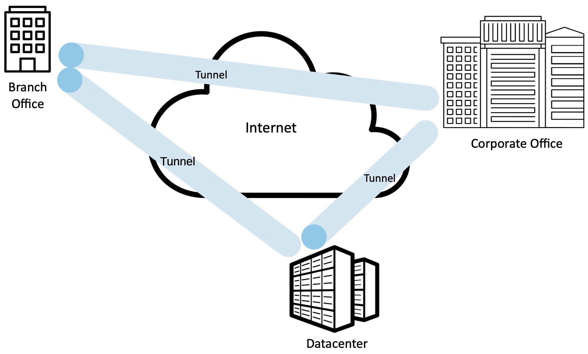

Chapter 7.  Subsystem Security
========================================

.. Assuming we keep a substantial set of examples, we should look
   for ways to highlight the underlying open source software (and the
   general role open source plays in helping secure the Internet --
   lots of eyes on the code).

Having focused on how to use the available cryptographic and
authentication building blocks to secure the transport layer—to the
benefit of all applications—we now turn our attention to examples of
how individual subsystems are secured. The examples address specific
threats—associated with specific use cases—that remain even when TLS
is deployed.

The systems described in this chapter are at different layers: some
are are built into applications, some run at the IP layer, and some
secure network links. While they address different layer-specific
threats, what the examples have in common is that they all leverage
the same set of security building blocks. Seeing how these building
blocks can be assembled in different ways to build different solutions
is the main value of this chapter. To this end, the following sections
focus on the use case and corresponding threat, with a high-level
description of how the system addresses the threat; no new algorithms
or fundamental capabilities are required.

It is also noteworthy that in addition to taking advantage of existing
building blocks, the example systems are highly configurable. The idea
of making a security system algorithm independent is a good one,
because you never know when your preferred cryptographic algorithm
might be proved to be insufficient for your purposes. Note
the analogy to being able to change keys without changing the
algorithm; if one of your cryptographic algorithms turns out to be
flawed, it would be great if your entire security architecture didn’t
need an immediate redesign.

7.1 Pretty Good Privacy (PGP)
------------------------------------------

Pretty Good Privacy (PGP) is an approach to providing authentication,
confidentiality, data integrity, and nonrepudiation for email.
Originally devised by Phil Zimmerman in 1991, it has evolved into an
IETF standard known as OpenPGP. As we saw in Chapter 4, PGP is notable
for using a “web of trust” model for distribution of keys rather than
a tree-like hierarchy.

The other thing of note about PGP is that it is *not* widely used, in
large part because most users elect to trust their email provider (or
rather, are not concerned about their email being used for marketing
purposes). In contrast, PGP is an option for users that put a premium
on privacy and being certain about who they are exchanging messages
with. The availability of easy-to-use client software has made
that option more viable over time.

PGP’s confidentiality and receiver authentication depend on the receiver
of a message having a public key that is known to the sender. To
provide sender authentication and nonrepudiation, the sender must have a
public key that is known by the receiver. These public keys are
predistributed using certificates and a web-of-trust PKI. PGP supports
RSA and DSS for public key certificates. These certificates may
additionally specify which cryptographic algorithms are supported or
preferred by the key’s owner. The certificates provide bindings between
email addresses and public keys.

.. _fig-pgpMessage:
.. figure:: figures/f08-13-9780123850591.png
   :width: 400px
   :align: center

   PGP’s steps to prepare a message for emailing from Alice to Bob.

Consider the following example of PGP being used to provide both
sender authentication and confidentiality. Suppose Alice has a message
to email to Bob. Alice’s PGP application goes through the steps
illustrated in :numref:`Figure %s <fig-pgpMessage>`. First, the
message is digitally signed by Alice; MD5, SHA-1, and the SHA-2 family
are among the hashes that may be used in the digital signature. Her
PGP application then generates a new session key for just this one
message; AES and 3DES are among the supported secret-key ciphers. The
digitally signed message is encrypted using the session key, then the
session key itself is encrypted using Bob’s public key and appended to
the message. Alice’s PGP application reminds her of the level of trust
she had previously assigned to Bob’s public key, based on the number
of certificates she has for Bob and the trustworthiness of the
individuals who signed the certificates. Finally, not for security but
because email messages have to be sent in ASCII, a base64 encoding is
applied to the message to convert it to an ASCII-compatible
representation. Upon receiving the PGP message in an email, Bob’s PGP
application reverses this process step-by-step to obtain the original
plaintext message and confirm Alice’s digital signature—and reminds
Bob of the level of trust he has in Alice’s public key.

PGP is not strictly for email, but email has particular
characteristics that allow PGP to embed an adequate authentication
protocol in this one-message data transmission protocol. This avoids
the need for any prior message exchange (and sidestepping some of the
complexities described in the earlier chapter). Alice’s digital
signature suffices to authenticate her. Although there is no proof
that the message is timely, legitimate email isn’t guaranteed to be
timely either. There is also no proof that the message is original,
but Bob is an email user and probably a fault-tolerant human who can
recover from duplicate emails (which, again, are not out of the
question under normal operation anyway). Alice can be sure that only
Bob could read the message because the session key was encrypted with
his public key.  Although this protocol doesn’t prove to Alice that
Bob is actually there and received the email, an authenticated email
from Bob back to Alice could do this.

The preceding discussion gives a good example of why application-layer
security mechanisms can be helpful. Only with a full knowledge of how
the application works can you make the right choices about which attacks
to defend against (like forged email) versus which to ignore (like
delayed or replayed email).

7.2 Secure Shell (SSH)
------------------------

The Secure Shell (SSH) protocol provides a remote login service,
replacing the less secure Telnet used in the early days of the
Internet. SSH can also be used to remotely execute commands and
transfer files. It is most often used to provide strong client/server
authentication/message integrity—where the SSH client runs on the
user’s laptop (for example) and the SSH server runs on some remote
machine that the user wants to log into—but it also supports
confidentiality. Telnet provides none of these capabilities. Note that
“SSH” is often used to refer to both the SSH protocol and applications
that use it; you need to figure out which from the context.

To better appreciate the importance of SSH in today’s Internet,
consider two scenarios where it is used. Telecommuters depend on some
chain of Internet service providers to reach machines operated
by their employer. This means that when a telecommuter logs into a
machine inside their employer’s data center, both the passwords and all
the data sent or received potentially passes through any number of
untrusted networks. SSH provides a way to encrypt the data sent over
these connections and to improve the strength of the authentication
mechanism used to log in. (A similar situation occurs when said
employee connects to work using the public Wi-Fi at a coffee shop.)

A second common usage of SSH is to login into a remote router, server,
or VM for the purpose of managing it; for example, changing its
configuration, reading its log files, or installing the latest software.
Clearly, administrators want to be sure that they can log into a
remote machine securely and that unauthorized parties can neither log
in nor intercept the commands sent to the machine or the output sent
back to the administrator. This use case is common enough that SSH is
often incorporated into more sophisticated management software that
automates some aspect of remote operations. This is increasingly the
case for tools that support Cloud DevOps, with GitHub, Docker,
Ansible, and Jenkins being popular examples that use SSH's remote
execution feature.

The latest stable version of SSH, Version 2, consists of three protocols:\ [#]_

-  SSH-TRANS, a transport layer protocol

-  SSH-AUTH, an authentication protocol

-  SSH-CONN, a connection protocol

We focus on the first two, which are involved in remote login. We
briefly discuss the purpose of SSH-CONN at the end of the section.

.. [#] Version 3 of SSH (SSH3) has also been proposed, but it is
   currently an experimental effort that changes the
   underlying protocols used by SSH. For example, SSH3 runs on top of
   QUIC (which is UDP-based) instead of TCP. SSH2 remains the widely
   adopted standard.

SSH-TRANS provides an encrypted channel between the client and server
machines. It runs on top of a TCP connection. Any time a user uses an
SSH application to log into a remote machine, the first step is to set
up an SSH-TRANS channel between those two machines. The two machines
establish this secure channel by first having the client authenticate
the server using RSA. Once authenticated, the client and server
establish a session key that they will use to encrypt any data sent over
the channel. This high-level description skims over several details,
including the fact that the SSH-TRANS protocol includes a negotiation of
the encryption algorithm the two sides are going to use. For example,
AES is commonly selected. Also, SSH-TRANS includes a message integrity
check of all data exchanged over the channel.

The one issue we can’t skim over is how the client came to possess the
server’s public key that it needs to authenticate the server. Strange as
it may sound, the server tells the client its public key at connection
time. The first time a client connects to a particular server, the SSH
application warns the user that it has never talked to this machine
before and asks if the user wants to continue. Although it is a risky
thing to do, because SSH is effectively not able to authenticate the
server, users often say “yes” to this question. The SSH application then
remembers the server’s public key, and the next time the user connects
to that same machine it compares this saved key with the one the server
responds with. If they are the same, SSH authenticates the server. If
they are different, however, the SSH application again warns the user
that something is amiss, and the user is then given an opportunity to
abort the connection. Alternatively, the prudent user can learn the
server’s public key through some out-of-band mechanism, save it on the
client machine, and thus never take the “first time” risk.

Once the SSH-TRANS channel exists, the next step is for the user to
actually log into the machine, or more specifically, authenticate
the user to the server. SSH allows three different mechanisms
for doing this. First, since the two machines are communicating over a
secure channel, it is OK for the user to simply send their password
to the server. This is not a safe thing to do when using Telnet since
the password would be sent in the clear, but in the case of SSH, the
password is encrypted in the SSH-TRANS channel. The second mechanism
uses public-key encryption. This requires that the user has already
placed their public key on the server. The third mechanism, called
*host-based authentication*, basically says that any user claiming to be
so-and-so from a certain set of trusted hosts is automatically believed
to be that same user on the server. Host-based authentication requires
that the client *host* authenticate itself to the server when the client first
connects; standard SSH-TRANS only authenticates the server by default.

The main thing you should take away from this discussion is that SSH
is a fairly straightforward application of the protocols and
algorithms we have seen throughout this book. However, what sometimes
makes SSH a challenge to understand is all the keys a user has to
create and manage, where the exact interface is operating system
dependent. For example, the OpenSSH package that runs on most Unix
machines (e.g., Linux, MacOS) supports a command (``ssh-keygen``) that
can be used to create public/private key pairs. These keys are then
stored in various files in directory in the user’s home directory. For
example, file ``~/.ssh/known_hosts`` records the keys for all the
hosts the user has logged into, file ``~/.ssh/authorized_keys``
contains the public keys needed to authenticate the user when logging
into this machine (i.e., they are used on the server side). The
private keys needed to authenticate the user on remote machines (i.e.,
keys that are used on the client side) are stored in a file whose name
depends on the algorithm. For example, an RSA key would be stored in a
file ``~/.ssh/id_rsa``; an ECDSA key would be stored in
``~/.ssh/id_edcsa`` and so on. These files are usually encrypted with
a secret passphrase to protect against the possibility of the private
key being compromised by an attacker who gains access to the file.

.. _fig-ssh-tunnel:
.. figure:: figures/f08-14-9780123850591.png
   :width: 500px
   :align: center

   Using SSH port forwarding to secure other TCP-based applications.

Finally, SSH has proven so useful for securing remote login that it
has been extended to also support other applications (e.g., sending
and receiving email). The idea is to run the applications over a
secure “SSH tunnel.” This capability is called *port forwarding*, and
it uses the SSH-CONN protocol. The idea is illustrated in
:numref:`Figure %s <fig-ssh-tunnel>`, where we see a client on host A
indirectly communicating with a server on host B by forwarding its
traffic through an SSH connection. The mechanism is called *port
forwarding* because when messages arrive at the well-known SSH port on
the server, SSH first decrypts the contents and then “forwards” the
data to the actual port at which the server is listening.

Port forwarding effectively creates a secure tunnel that provides
confidentiality and authentication. It is possible to provide a kind
of virtual private network (VPN) using SSH tunnels in this way, but
unlike the VPN mechanism described in the next section, SSH tunnels to
a single remote machine rather than to a remote network. The latter
gives you access to *any* machine on the local network. In practice,
it is also the case that corporate firewalls often block port 22 (SSH's
well-known port), limiting the situations in which SSH works as a
VPN-like tunnel.

7.3 IP Security (IPsec)
--------------------------------

One of the earliest efforts to integrate security into the Internet
sits at the IP layer. Support for IPsec, as the architecture is
called, is optional in IPv4 but mandatory in IPv6. Indeed, better
security was one of the stated goals of IPv6, although it turned out
that the central ideas could also be retrofitted into IPv4. It's also
noteworthy that while the original intent was for IPsec to be part of
securing the network infrastructure (as discussed in the next
chapter), today IPsec is most commonly used to implement secure
tunnels running on top of the public Internet. These tunnels are often
part of a Virtual Private Network (VPN), for example, connecting a
remote user to their "home" enterprise network. We turn our attention
to VPNs in the next section.

IPsec is really a framework (as opposed to a single protocol or
system) for providing a broad set of security services. It provides
three degrees of freedom. First, it is highly modular, allowing users
(or more likely, system administrators) to select from a variety of
cryptographic algorithms and specialized security protocols. Second,
IPsec allows users to select from a large menu of security properties,
including access control, integrity, authentication, originality, and
confidentiality. Third, IPsec can be used to protect narrow streams
(e.g., packets belonging to a particular TCP connection being sent
between a pair of hosts) or wide streams (e.g., all packets flowing
between a pair of routers or locations).

When viewed from a high level, IPsec consists of two parts. The first
part is a pair of protocols that implement the available security
services. They are the Authentication Header (AH), which provides access
control, connectionless message integrity, authentication, and
antireplay protection, and the Encapsulating Security Payload (ESP),
which supports these same services, plus confidentiality. AH is rarely
used so we focus on ESP here. The second part is support for key
management, which fits under an umbrella protocol known as the Internet
Security Association and Key Management Protocol (ISAKMP).

The abstraction that binds these two pieces together is the *security
association* (SA). An SA is a simplex (one-way) connection with one or
more of the available security properties. Securing a bidirectional
communication between a pair of hosts—corresponding to a TCP connection,
for example—requires two SAs, one in each direction. Although IP is a
connectionless protocol, security depends on connection state
information such as keys and sequence numbers. When created, an SA is
assigned an ID number called a *security parameters index* (SPI) by the
receiving machine. A combination of this SPI and the destination IP
addresses uniquely identifies an SA. An ESP header includes the SPI so
the receiving host can determine which SA an incoming packet belongs to
and, hence, what algorithms and keys to apply to the packet.

SAs are established, negotiated, modified, and deleted using ISAKMP. It
defines packet formats for exchanging key generation and authentication
data. These formats aren’t terribly interesting because they provide a
framework only—the exact form of the keys and authentication data
depends on the key generation technique, the cipher, and the
authentication mechanism that is used. Moreover, ISAKMP does not specify
a particular key exchange protocol, although it does suggest the
Internet Key Exchange (IKE) as one possibility, and IKE v2 is what is
used in practice.

ESP is the protocol used to securely transport data over an established
SA. In IPv4, the ESP header follows the IP header; in IPv6, it is an
extension header. Its format uses both a header and a trailer, as shown
in :numref:`Figure %s <fig-esp>`. The ``SPI`` field lets the receiving host
identify the security association to which the packet belongs. The
``SeqNum`` field protects against replay attacks. The packet’s
``PayloadData`` contains the data described by the ``NextHdr`` field. If
confidentiality is selected, then the data is encrypted using whatever
cipher was associated with the SA. The ``PadLength`` field records how
much padding was added to the data; padding is sometimes necessary
because, for example, the cipher requires the plaintext to be a multiple
of a certain number of bytes or to ensure that the resulting ciphertext
terminates on a 4-byte boundary. Finally, the ``AuthenticationData``
carries the authenticator.

.. _fig-esp:
.. figure:: figures/f08-17-9780123850591.png
   :width: 500px
   :align: center

   IPSec’s ESP format.

IPsec supports a *tunnel mode* as well as the more straightforward
*transport mode*. Each SA operates in one or the other mode. In a
transport mode SA, ESP’s payload data is simply a message for a higher
layer such as UDP or TCP. In this mode, IPsec acts as an intermediate
protocol layer, much like SSL/TLS does between TCP and a higher layer.
When an ESP message is received, its payload is passed to the higher
level protocol.

In a tunnel mode SA, however, ESP’s payload data is itself an IP
packet, as in :numref:`Figure %s <fig-espTunnelPacket>`. The source
and destination of this inner IP packet may be different from those of
the outer IP packet.  When an ESP message is received, its payload is
forwarded on as a normal IP packet. The most common way to use the ESP
is to build an “IPsec tunnel” between two routers, typically
firewalls. For example, a corporation wanting to link two sites using
the Internet could open a pair of tunnel-mode SAs between a router at
one site and a router at the other site. An IP packet outgoing from
one site would, at the outgoing router, become the payload of an ESP
message sent to the other site’s router. The receiving router would
unwrap the payload IP packet and forward it on to its true
destination.

.. _fig-espTunnelPacket:
.. figure:: figures/f08-18-9780123850591.png
   :width: 600px
   :align: center

   An IP packet with a nested IP packet encapsulated using ESP in tunnel
   mode. Note that the inner and outer packets have different addresses.

These tunnels may also be configured to use ESP with confidentiality
and authentication, thus preventing unauthorized access to the data
that traverses this virtual link and ensuring that no spurious data is
received at the far end of the tunnel. Furthermore, tunnels can
provide traffic confidentiality, since multiplexing multiple flows
through a single tunnel obscures information about how much traffic is
flowing between particular endpoints. As noted above, a network of
such tunnels can be used to implement an entire virtual private
network. But there is more to VPNs than just tunneling mechanisms, as
we discuss below.

7.4 Virtual Private Networks (VPNs)
------------------------------------

A virtual private network (VPN) can be built using a wide variety of
different technologies, but any VPN requires that we establish
connectivity among a set of endpoints. The connections must
offer some level of privacy to the principals communicating between
those endpoints. Furthermore, to qualify as a *virtual* private
network, a VPN creates the illusion of being dedicated to a group of
users, even though the underlying infrastructure is shared more
widely. In practice, this means that a VPN is almost always built as
some sort of overlay on shared infrastructure.

The type of VPN that we will focus on here uses
tunneling technologies such as IPsec or SSL to provide private
connectivity across the shared infrastructure of the Internet. We have
already seen how encrypted tunnels can be established, but tunnels are
just a building block for VPNs. VPN requirements vary among
different use cases, so we begin our discussion by looking at some of
the most common uses for VPNs.

*Remote Access VPNs* are commonly used to support remote workers,
telecommuters, or contractors who need access to corporate
resources. :numref:`Figure %s <fig-remotevpn>` shows a simple example
where a remote user tunnels across the Internet to connect to their
corporate office. 

.. _fig-remotevpn:

   A remote user connects via a tunnel to a corporate site.

*Site-to-Site VPNs* are generally used to interconnect the sites of an
enterprise, which could include datacenters, main corporate offices,
and branch offices. :numref:`Figure %s <fig-sitevpn>` shows a simple
example for three sites of difference sizes.

.. _fig-sitevpn:

   A corporate VPN connects a main office, a branch office, and a datacenter.

Viewed at this level of abstraction, there are obvious similarities
between these VPN classes. They are not entirely non-overlapping but they
help us identify the requirements. The differences become apparent
when we look at the types of devices that terminate tunnels and the
methods used to establish them.

Remote access VPNs usually establish tunnels directly from a client
device, such as a phone or a laptop, to a device at the edge of the
corporate network called a VPN gateway or concentrator. Some VPN
client software performs this task, with WireGuard and OpenVPN being
two examples of open source, multi-platform clients. There are plenty
of proprietary options as well.

OpenVPN leverages TLS to build the encrypted tunnels from client to
server. While this mostly follows the same protocol as described in
Chapter 6, the additional step of authenticating the client is almost
always required in VPN use cases, unlike most Web usages of
TLS. Client certificates may be used, but this raises the issue of how
certificates can be reliably distributed to client devices. One option
is that they are provisioned by a corporate IT department as part of
setting up client devices. OpenVPN also allows for other
authentication methods including username plus password and optionally
multi-factor authentication.

WireGuard is a more recent implementation of encrypted tunnels that
aims to address some shortcomings that have emerged over years of
using IPsec and OpenVPN tunnels. The paper below from NDSS 2017 lays
out the design philosophy of WireGuard. Compared to OpenVPN, it is
less complex by virtue of reducing the set of cryptographic algorithms
that it supports. It establishes "stateless" tunnels that are more like
IPsec than TLS—that is, there is no transport connection to
establish. It also uses the idea of pre-shared public keys for mutual
authentication, similar to the approach used in SSH. Finally, it is
implemented in the operating system kernel, another contrast to
OpenVPN that improves performance. For further details we refer you to
the paper. 

.. admonition:: Further Reading

   J. Donenfeld. `WireGuard: Next Generation Kernel Network Tunnel
      <https://www.ndss-symposium.org/ndss2017/ndss-2017-programme/WireGuard-next-generation-kernel-network-tunnel/>`__.
      NDSS, 2017.

One of these types of tunnels plus a gateway or concentrator to
terminate them is pretty much all that is needed to deliver a remote
access VPN. A concentrator is just an appliance that can handle a
large number of VPN tunnels at once, and provides the necessary
administrative controls for managing user accounts and interfaces for
passing the VPN traffic on to the corporate network. Note that a
remote access VPN will almost always have to solve the problem of how
to get traffic through the corporate firewall. We cover firewalls in a
later chapter, but it is generally the case that VPN traffic will be
allowed to traverse the firewall so that the VPN user can access
corporate resources. The problems of this approach are discussed in
the firewalls chapter.

The main difference with site-to-site VPNs is that they aim to connect
entire networks together, not just the devices of single remote
users. And because office buildings don't move around the way users
do, these VPNs are relatively static. Thus, one early approach to
building site-to-site VPNs was to simply configure tunnels statically
from a router at the edge of one site to a router at the edge of
another. Keys could also be statically configured. This would be OK
for a small VPN, but as the number of sites increases, the
configuration overhead becomes considerable. Furthermore, there is not
likely to be an on-site routing and security expert at every branch
office, so the configuration would have to be set once before the
router was shipped out to the branch and after that point, changes
become difficult, especially if the router becomes unreachable for
some reason. On top of this, if the connectivity among sites is
anything other than a hub and spoke, then the issue of correctly
configuring routing protocols to forward traffic across the mesh of
tunnels becomes significant.

The complexity of configuring and managing a VPN comprised of
encrypted tunnels is one reason why MPLS VPNs, which outsource
most of the complexity of VPN management to a service provider, became
such a successful service offering in the early 2000s. MPLS does not
protect privacy using encryption, but it does solve the issues of routing
traffic among large numbers of sites and ensures that the traffic
belonging to one customer from does not leak to the network of another. 

Several approaches to reduce the configuration overhead for VPNs using
encrypted tunnels have appeared in recent years. With the rise of
software-defined networking in the 2010s, several companies hit on the
idea of using a centralized SDN controller to manage the configuration
challenges outlined above. This approach, known as
SD-WAN, became one of the successful commercial applications of SDN.

7.4.1 Software-Defined WANs
~~~~~~~~~~~~~~~~~~~~~~~~~~~

Provisioning a VPN using MPLS, while less complex than most earlier
options, still requires some significant local configuration of both
the Customer Edge (CE) router located at each customer site, and the
Provider Edge (PE) router to which that site would be connected. In
addition, it would typically require the provisioning of a circuit
from the customer site to the nearest point of presence for the
appropriate Telco.

With SD-WAN, the assumption is that every branch and head
office has connectivity to the Internet. An edge router is deployed at
each site, and a centralized control plane is used to simplify
configuration. An enterprise wants its sites—and only its authorized
sites—to be interconnected by the VPN, and it typically wants to apply
a set of policies regarding security, traffic prioritization, access
to shared services, and so on. These policies are input to a central
controller, which can then push out all the necessary configuration to
the edge router located at the appropriate office. Rather than
manually configuring a router or (multiple routers) every time a new site is added, or
configuring tunnels by hand, it is possible to achieve "zero-touch"
provisioning: an appliance is shipped to the new site with nothing
more than a certificate and an address to contact, which it then uses
to contact the central controller and obtain all the configuration it
needs.  Anything that is necessary to build site-to-site tunnels—IP
addresses, routing configuration, secrets, etc.—can be pushed out from
the central controller to the edge router. Changes to configuration or
policies, which might affect many sites, are input centrally and
pushed out to all affected sites.  The idea is illustrated in
:numref:`Figure %s <fig-sd-wan>`.

.. _fig-sd-wan:
.. figure:: figures/Slide43.png
    :width: 600px
    :align: center

    An SD-WAN controller receives policies centrally and pushes them
    out to edge switches at various sites. The switches build an
    overlay of tunnels over the Internet or other physical networks,
    and implement policies including allowing direct access to cloud
    services.

It can be hard to determine exactly what properties of SD-WAN have
made it popular, especially as vendors promote the features that
distinguish their solution from the others. Unlike much of SDN, the
control plane protocols used in SD-WAN tend to be proprietary. But it
is certainly true that SD-WAN did enough to reduce the complexity of
building and managing encrypted tunnels to drive adoption of this
approach, often replacing MPLS-based VPNs.

An important benefit offered by SD-WAN over many earlier VPN
approaches was to simplify the task of managing access from a branch
office to a cloud service offered by a third party. It
seems natural that you would choose to access those services directly
from an Internet-connected branch, but traditional VPNs would
*backhaul* traffic to a central site before sending it out to the
Internet, precisely so that security policies could be controlled
centrally. With SD-WAN, the central control over security policy is achieved, while the data
plane remains fully distributed–meaning that remote sites can directly
connect to the cloud services without backhaul.

7.4.2 Mesh VPNs
~~~~~~~~~~~~~~~

Another approach to VPNs that combines some of the features of remote
access VPNs and site-to-site VPNs is referred to as Mesh VPNs. Like a
remote VPN, a mesh VPN builds tunnels that terminate directly on
client devices. However, rather than connecting the other end of the
tunnel to a central VPN gateway or concentrator, mesh VPNs build a
mesh of tunnels among client devices. The effect is to create a VPN
that interconnects the set of authorized client devices almost as if
they were on the same private LAN, even though they can be located
anywhere in the Internet.

There are numerous implementations of the mesh VPN approach, with
Tailscale being a well-known implementation that contains a mixture of
open source and proprietary components. Tailscale is
built using WireGuard as the tunneling protocol, and adds a control
and management plane to ease the task of setting up and managing the
mesh. For example, WireGuard makes the assumption that public keys
have been set up at the tunnel endpoints before the tunnel is
established; Tailscale supplies a central coordination service to
generate and distribute those keys.

One notable aspect of Tailscale is that it assumes that client devices
are likely to be sitting in networks that use private addresses and
are connected to the Internet through a NAT (network address
translation) device. This problem doesn't exist when building a tunnel
to a VPN concentrator with a public IP address, or between a pair of
edge routers, but it has to be solved if you want to build
client-to-client tunnels. There are quite a few details to getting
this to work, especially given that NAT devices don't all behave the
same way, and there may be firewalls to travese as well. An IETF
standard called STUN (Session Traversal Utilities for NAT) plays an
important part, and the centralized control plane helps to resolve
some of the more difficult corner cases. You can read more about the
issues to be solved in the blog post listed below.

Because mesh VPNs build tunnels all the way from client to client,
they also avoid one of the drawbacks of traditional VPNs, which is the
existence of trusted network zones, such as the network behind the
firewall to which a remote access or site-to-site VPN would give
access. In this respect they embrace the idea of zero trust
networking, a topic we discuss in chapter 9.

.. admonition:: Further Reading

   A. Pennarun. `How Tailscale Works <https://tailscale.com/blog/how-tailscale-works>`__.
      Tailscale blog, 2020.

7.5 Web Authentication (WebAuthn) and Passkeys
----------------------------------------------------------------

While public key cryptography has been well understood for decades,
and forms the basis for authentication of web sites using Transport
Layer Security, its adoption for authentication of end-users has
generally proven challenging. PGP was an early effort to allow
end-users to authenticate themselves with public key cryptography, but
if you need to authenticate yourself to, say, your bank, it's
overwhelmingly the case today that you will use some combination of
user name (maybe an account number or an email address) and a
password. Perhaps another factor, such as a one-time code sent to your
phone, will also be used. Encryption (using TLS) prevents your password
from being seen by eavesdroppers when it is sent to the bank's site,
but currently there is little deployment of public key cryptography
for the authentication of users. SSH, as noted above, supports the use
of public keys for user authentication, but it's hardly in mainstream
use by consumers on the Internet.

Password-based authentication had proven enormously problematic, with
passwords frequently being compromised by a variety of attacks. If a
user's password is obtained by an attacker, the attacker can now
impersonate the user to authenticate himself. Passwords might be
obtained using brute-force search, which works well on passwords that
are relatively short or simple, and has become easier over time with
increased computing power. Because many people re-use passwords across
multiple sites, if a password is obtained from a breach of one site,
it can often be used on other sites. And a range of *phishing attacks*
entail somehow tricking a user into putting his login credentials
into a fraudulent web site. This might be initiated with an email
leading the user to input his credentials to a domain name similar
to the expected one, on a site that mimics the visual style of the
legitimate web site.

A range of efforts have been under way for many years to reduce the
reliance on passwords and to drive adoption of public key cryptography
for end-user authentication. The most visible recent development has
been the appearance of *passkeys*, which, as the name suggests, are a
form of user authentication that replaces passwords with public
key-based authentication. The challenge is to automate key management
on behalf of the user.

.. can add a figure here

Passkeys are formally known as *discoverable credentials* and are
defined in the Web Authentication (WebAuthn) specification of the W3C
(World Wide Web Consortium). This work evolved from several prior
efforts including those of the FIDO alliance (FIDO = Fast Identity
Online).

The basic idea behind passkeys is simple: a user (or more likely, a
device owned by the user) creates a private/public key pair
specifically for a single web site and provides the public key to the
site. The user proves their identity to the web site using some other
method such as a previously established user name and password. The
web site stores the public key for subsequent use. The next time that
the user wants to authenticate to the web site, the site issues a
challenge to the user, who uses the locally stored private key to sign
their response to the challenge. The web site uses the stored public
key to authenticate the user. Said another way, if you are familiar
with SSH's use of public/private key pairs to authenticate a user
logging into a remote server, you understand how passkeys are used to
log into a remote web service.

The fact that the process is bootstrapped by getting the user to
authenticate using a traditional approach (such as user name and
password) is clearly a bit of a weakness. At the same time, it
solves the thorny problem of how to scalably bind public
keys to users which has proven challenging to date. Additional steps
to secure the initial authentication might include the use of
multi-factor authentication.

Passkeys offer two protections against phishing. First, the private
key is never transmitted, being used only to sign the response to a
challenge. Second, passkeys are bound to a specific web site. So a
user will have a different private/public key pair for every web site
they want to authenticate to. When the authentication challenge is
received from the web site, the client-side software checks that it is
coming from the correct web site using the standard authentication
methods of TLS. A fraudulent web site will fail this check, so the
user will not try to authenticate to the site.

Of course, if passkeys are to be effective as a phishing-prevention
tool, they need to *replace* passwords, not just supplement them. If
passwords remain available as an alternative, it seems safe to assume
that attackers will keep using that option to breach user
accounts. This is one of the problems that needs to be addressed in
the deployment of passkeys.

The WebAuthn spec allows for considerable implementation flexibility,
but there are two broad categories of passkey implementation. One
approach binds the key to a specific piece of hardware, such as a USB
key. Such keys have been around for many years and known by various
names as the commercial offerings and standards around them have
evolved. The generic names include U2F (universal second factor) and
FIDO (from the FIDO Alliance).

Now that biometric authentication, such as facial and fingerprint
recognition, is available on many devices, it is common to require
biometric authentication to access a passkey. So a passkey might be
stored on a mobile phone and require facial recognition of the owner
before the passkey can be accessed.

The second class of passkey implementation allows the credentials to
be copied among multiple devices, typically using some sort of
password manager to keep the credentials secure and synchronized
across devices. In this case, the private/public key pair is stored in
the password manager and then is made available to the user across
different devices (laptops, mobile phones, etc.) when they need the
passkey.

There are strengths and weaknesses for each approach. Hardware tokens
make phishing attacks almost impossible, since the only way to get
access to the user's credential is to have physical access to the
key. A password manager, on the other hand, is a piece of software
that normally has some cloud service behind it to handle
synchronization across devices. If an attacker manages
to get access to the credentials necessary to log in to the cloud
service, then they have access to the passkeys stored within it. For
this reason (among others) password managers are generally secured
with some sort of multi-factor authentication. One of those factors
might be biometric, or even a hardware token.

The downside of hardware tokens is that the private key is stored only
in one place. If the hardware token is lost, there is no way to
recover the private key, so some other authentication method is
needed as a backup. Also, since most hardware tokens lack biometric
authentication, it is possible that a private key could be obtained
and used by an attacker if he can gain access to the physical key.

Many of the important details of WebAuthn come down to making public
key cryptography accessible to average users, rather than just the
domain of the tech-savvy. This is where PGP, for example, has
struggled to gain wider acceptance. WebAuthn is now part of the
standards that are widely implemented for the World Wide Web, meaning
that there are implementations across many browsers and web
servers. There is also a well-defined API to allow authentication
devices (such as FIDO keys) to communicate with browsers to manage the
creation and use of private/public key pairs.

We are still in the relatively early days of passkeys as they start to
become available on a wide variety of operating systems and web
sites. Those who have led their development hope that they start to
replace the ubiquitous password for user authentication.

7.6 Wireless Security
--------------------------------------------

Wireless links are particularly exposed to security threats due to the
lack of any physical security on the medium. While the convenience of
802.11 (Wi-Fi) and the Mobile Cellular Network (5G) has prompted
widespread acceptance of the technology, concerns about security have
been a recurring topic. This section looks at how the two dominant
wireless technologies address the issue.

Note that securing a wireless link can be viewed as an example of
defense in depth introduced in Chapter 2. As long as your transport
layer connection is secured by TLS and/or your VPN securely tunnels
over the public Internet using IPsec, the confidentiality of your
communication is ensured; securing the wireless link is partially
redundant. Not all users are that careful, of course, but there are
also control packets exchanged between the wireless device and the
wired infrastructure, and that communication must be secured.

7.6.1  Wi-Fi (802.11i)
~~~~~~~~~~~~~~~~~~~~~~~~~~~~~~~~~~~

It has long been understood how easy it is for an employee of a
corporation to connect an 802.11 access point to the corporate
network. Since radio waves pass through most walls, if the access
point lacks the correct security measures, an attacker can now gain
access to the corporate network from outside the building.  Similarly,
a computer with a wireless network adaptor inside the building could
connect to an access point outside the building, potentially exposing
it to attack, not to mention the rest of the corporate network if that
same computer has, say, an Ethernet connection as well.

Consequently, there has been considerable work on securing Wi-Fi links.
The IEEE 802.11i standard provides authentication, message integrity,
and confidentiality to 802.11 (Wi-Fi) at the link layer. *WPA3* (Wi-Fi
Protected Access 3) is often used as a synonym for 802.11i, although it
is technically a trademark of the Wi-Fi Alliance that certifies product
compliance with 802.11i.

For backward compatibility, 802.11i includes definitions of
first-generation security algorithms—including Wired Equivalent
Privacy (WEP)—that are now known to have major security flaws. We will
focus here on 802.11i’s newer, stronger algorithms.

802.11i authentication supports two modes. In either mode, the end
result of successful authentication is a shared Pairwise Master Key.
*Personal mode*, also known as *Pre-Shared Key (PSK) mode*, provides
weaker security but is more convenient and economical for situations
like a home 802.11 network. The wireless device and the Access Point
(AP) are preconfigured with a shared *passphrase*—essentially a very
long password—from which the Pairwise Master Key is cryptographically
derived.

802.11i’s stronger authentication mode is based on the IEEE 802.1X
framework for controlling access to a LAN, which uses an
Authentication Server (AS) as in :numref:`Figure %s
<fig-AuthenServer>`. The AS and AP must be connected by a secure
channel and could even be implemented as a single box, but they are
logically separate. The AP forwards authentication messages between
the wireless device and the AS. The protocol used for authentication
is called the *Extensible Authentication Protocol* (EAP).  EAP is
designed to support multiple authentication methods—smart cards,
Kerberos, one-time passwords, public key authentication, and so on—as
well as both one-sided and mutual authentication. So EAP is better
thought of as an authentication framework than a protocol. Specific
EAP-compliant protocols, of which there are many, are called *EAP
methods*. For example, EAP-TLS is an EAP method based on TLS
authentication.

.. _fig-AuthenServer:
.. figure:: figures/f08-19-9780123850591.png
   :width: 500px
   :align: center

   Use of an Authentication Server in 802.11i.

802.11i does not place any restrictions on what the EAP method can use
as a basis for authentication. It does, however, require an EAP method
that performs *mutual* authentication, because not only do we want to
prevent an adversary from accessing the network via our AP, we also want
to prevent an adversary from fooling our wireless devices with a bogus,
malicious AP. The end result of a successful authentication is a
Pairwise Master Key shared between the wireless device and the AS, which
the AS then conveys to the AP.

One of the main differences between the stronger AS-based mode and the
weaker personal mode is that the former readily supports a unique key
per client. This in turn makes it easier to change the set of clients
that can authenticate themselves (e.g., to revoke access to one client)
without needing to change the secret stored in every client.

With a Pairwise Master Key in hand, the wireless device and the AP
execute a session key establishment protocol called the 4-way handshake
to establish a Pairwise Transient Key. This Pairwise Transient Key is
really a collection of keys that includes a session key called a
*Temporal Key*. This session key is used by the protocol, called *CCMP*,
that provides 802.11i’s data confidentiality and integrity.

CCMP stands for CTR (Counter Mode) with CBC-MAC (Cipher-Block Chaining
with Message Authentication Code) Protocol. CCMP uses AES in counter
mode to encrypt for confidentiality. Recall that in counter mode
encryption successive values of a counter are incorporated into the
encryption of successive blocks of plaintext.

CCMP uses a Message Authentication Code (MAC) as an authenticator. The
MAC algorithm is based on CBC, even though CCMP doesn’t use CBC in the
confidentiality encryption. In effect, CBC is performed without
transmitting any of the CBC-encrypted blocks, solely so that the last
CBC-encrypted block can be used as a MAC (only its first 8 bytes are
actually used). The role of initialization vector is played by a
specially constructed first block that includes a 48-bit packet number—a
sequence number. (The packet number is also incorporated in the
confidentiality encryption and serves to expose replay attacks.) The MAC
is subsequently encrypted along with the plaintext in order to prevent
birthday attacks, which depend on finding different messages with the
same authenticator.

7.6.2  Mobile Cellular Network
~~~~~~~~~~~~~~~~~~~~~~~~~~~~~~~~~

The other widely used wireless networking technology is the Mobile
Cellular Network, today ubiquitously known as 5G. The biggest
difference between 5G and Wi-Fi is that the Mobile Network Operator
(MNO)—the counterpart of an enterprise network administrator—has more
direct control over the devices that are allowed to connect to their
network. Specifically, the MNO provides a Subscriber Identity Module
(SIM) that must be present in the mobile device. This SIM contains a
small database that includes (among several dozen parameters used to
control the device) two values that play a central role in link
security: (1) a unique *International Mobile Subscriber Identifier
(IMSI)* and (2) a secret key.

.. _fig-AMF:

   Device authentication in the Mobile Cellular Network.

When a device first becomes active, it communicates with a nearby base
station over an unauthenticated radio channel. The base station, which
is part of the *Radio Access Network (RAN)*, forwards the request to a
backend system, known as the *Mobile Core*, over a secure backhaul
connection. The Mobile Core is essentially an IP router that connects
the RAN to the rest of the Internet, and among its many sub-components,
an *Access and Mobility Management Function (AMF)* plays a central
role in securing the wireless link on behalf of the newly connected device.
Loosely speaking, the AMF is analogous to the AS used by Wi-Fi. For a
more precise description of the Mobile Cellular Network, we recommend
a companion book.

.. admonition:: Further Reading

   L. Peterson, O. Sunay, and B. Davie. `Private 5G: A Systems
      Approach. <https://5g.systemsapproach.org>`__.

Assuming the AMF recognizes the IMSI, it initiates an authentication
protocol with the device. There are a set of options for
authentication and encryption, but AES is commonly used. Note that
this authentication exchange is initially in the clear since the base
station to device channel is not yet secure.

Once the device and AMF are satisfied with each other's identity, the
AMF informs the other sub-components of the Mobile Core and RAN of the
parameters they will need to service the device (e.g., the IP address
assigned to the device and the appropriate QoS parameters). It also
instructs the base station to establish an encrypted channel to the
device and sends the device the symmetric key it will subsequently use
for the encrypted data channel with the base station.  This symmetric
key is encrypted using the public key of the device, so only the
device can decrypt it. It does this using the secret key on its SIM
card. Once complete, the device can use this encrypted channel to send
and receive data over the wireless link to the base station.

