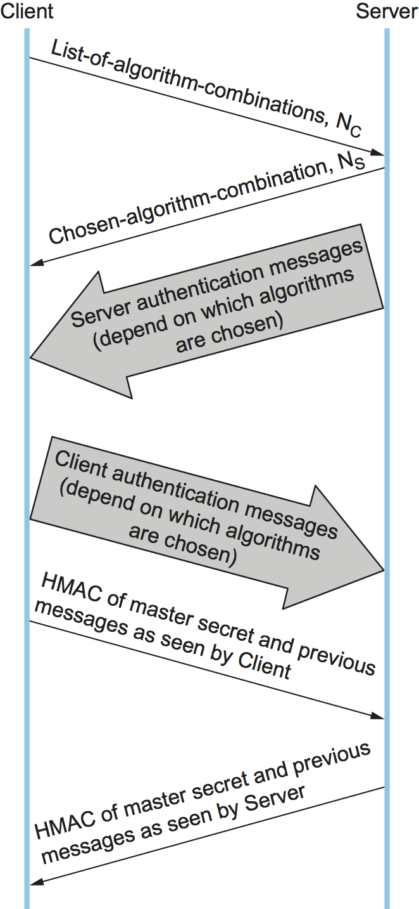

Chapter 6. Transport Layer Security (TLS, SSL, HTTPS)
=======================================================

To understand the design goals and requirements for the Transport Layer
Security (TLS) standard and the Secure Socket Layer (SSL) on which TLS
is based, it is helpful to consider one of the main problems that they
are intended to solve. As the World Wide Web became popular and
commercial enterprises began to take an interest in it, it became clear
that some level of security would be necessary for transactions on the
Web. The canonical example of this is making purchases by credit card.
There are several issues of concern when sending your credit card
information to a computer on the Web. First, you might worry that the
information would be intercepted in transit and subsequently used to
make unauthorized purchases. You might also worry about the details of a
transaction being modified, such as changing the purchase amount. And
you would certainly like to know that the computer to which you are
sending your credit card information is in fact one belonging to the
vendor in question and not some other party. Thus, we immediately see a
need for confidentiality, integrity, and authentication in Web
transactions. The first widely used solution to this problem was SSL,
originally developed by Netscape and subsequently the basis for the
IETF’s TLS standard.

The designers of SSL and TLS recognized that these problems were not
specific to Web transactions (i.e., those using HTTP) and instead built
a general-purpose protocol that sits between an application protocol
such as HTTP and a transport protocol such as TCP. The reason for
calling this “transport layer security” is that, from the application’s
perspective, this protocol layer looks just like a normal transport
protocol except for the fact that it is secure. That is, the sender can
open connections and deliver bytes for transmission, and the secure
transport layer will get them to the receiver with the necessary
confidentiality, integrity, and authentication. By running the secure
transport layer on top of TCP, all of the normal features of TCP
(reliability, flow control, congestion control, etc.) are also provided
to the application. This arrangement of protocol layers is depicted in
:numref:`Figure %s <fig-tls-stack>`.

.. _fig-tls-stack:
.. figure:: figures/f08-15-9780123850591.png
   :width: 300px
   :align: center

   Secure transport layer inserted between application and TCP layers.

When HTTP is used in this way, it is known as HTTPS (Secure HTTP). In
fact, HTTP itself is unchanged. It simply delivers data to and accepts
data from the SSL/TLS layer rather than TCP. For convenience, a default
TCP port has been assigned to HTTPS (443). That is, if you try to
connect to a server on TCP port 443, you will likely find yourself
talking to the SSL/TLS protocol, which will pass your data through to
HTTP provided all goes well with authentication and decryption. Although
standalone implementations of SSL/TLS are available, it is more common
for an implementation to be bundled with applications that need it,
primarily web browsers.

In the remainder of our discussion of transport layer security, we focus
on TLS. Although SSL and TLS are unfortunately not interoperable, they
differ in only minor ways, so nearly all of this description of TLS
applies to SSL.

6.1 Handshake Protocol
-----------------------

A pair of TLS participants negotiate at runtime which cryptography to
use. The participants negotiate a choice of:

-  Data integrity hash (MD5, SHA-1, etc.), used to implement HMACs

-  secret-key cipher for confidentiality (among the possibilities are
   DES, 3DES, and AES)

-  Session key establishment approach (among the possibilities are
   Diffie-Hellman, and public-key authentication protocols using DSS)

Interestingly, the participants may also negotiate the use of a
compression algorithm, not because this offers any security benefits,
but because it’s easy to do when you’re negotiating all this other stuff
and you’ve already decided to do some expensive per-byte operations on
the data.

In TLS, the confidentiality cipher uses two keys, one for each
direction, and similarly two initialization vectors. The HMACs are
likewise keyed with different keys for the two participants. Thus,
regardless of the choice of cipher and hash, a TLS session requires
effectively six keys. TLS derives all of them from a single shared
*master secret*. The master secret is a 384-bit (48-byte) value that in
turn is derived in part from the “session key” that results from TLS’s
session key establishment protocol.

The part of TLS that negotiates the choices and establishes the shared
master secret is called the *handshake protocol*. (Actual data transfer
is performed by TLS’s *record protocol*.) The handshake protocol is at
heart a session key establishment protocol, with a master secret instead
of a session key. Since TLS supports a choice of approaches to session
key establishment, these call for correspondingly different protocol
variants. Furthermore, the handshake protocol supports a choice between
mutual authentication of both participants, authentication of just one
participant (this is the most common case, such as authenticating a
website but not a user), or no authentication at all (anonymous
Diffie-Hellman). Thus, the handshake protocol knits together several
session key establishment protocols into a single protocol.

:numref:`Figure %s <fig-tls-hand>` shows the handshake protocol at a
high level.  The client initially sends a list of the combinations of
cryptographic algorithms that it supports, in decreasing order of
preference. The server responds, giving the single combination of
cryptographic algorithms it selected from those listed by the
client. These messages also contain a *client nonce* and a *server
nonce*, respectively, that will be incorporated in generating the
master secret later.

.. _fig-tls-hand:

   Handshake protocol to establish TLS session.

At this point, the negotiation phase is complete. The server now sends
additional messages based on the negotiated session key establishment
protocol. That could involve sending a public-key certificate or a set
of Diffie-Hellman parameters. If the server requires authentication of
the client, it sends a separate message indicating that. The client then
responds with its part of the negotiated key exchange protocol.

Now the client and server each have the information necessary to
generate the master secret. The “session key” that they exchanged is not
in fact a key, but instead what TLS calls a *pre-master secret*. The
master secret is computed (using a published algorithm) from this
pre-master secret, the client nonce, and the server nonce. Using the
keys derived from the master secret, the client then sends a message
that includes a hash of all the preceding handshake messages, to which
the server responds with a similar message. This enables them to detect
any discrepancies between the handshake messages they sent and received,
such as would result, for example, if a man in the middle modified the
initial unencrypted client message to weaken its choices of
cryptographic algorithms.

6.3.2 Record Protocol
~~~~~~~~~~~~~~~~~~~~~

Within a session established by the handshake protocol, TLS’s record
protocol adds confidentiality and integrity to the underlying transport
service. Messages handed down from the application layer are:

1. Fragmented or coalesced into blocks of a convenient size for the
   following steps

2. Optionally compressed

3. Integrity-protected using an HMAC

4. Encrypted using a secret-key cipher

5. Passed to the transport layer (normally TCP) for transmission

The record protocol uses an HMAC as an authenticator. The HMAC uses
whichever hash algorithm (MD5, SHA-1, etc.) was negotiated by the
participants. The client and server have different keys to use when
computing HMACs, making them even harder to break. Furthermore, each
record protocol message is assigned a sequence number, which is included
when the HMAC is computed—even though the sequence number is never
explicit in the message. This implicit sequence number prevents replays
or reorderings of messages. This is needed because, although TCP can
deliver sequential, unduplicated messages to the layer above it under
normal assumptions, those assumptions do not include an adversary that
can intercept TCP messages, modify messages, or send bogus ones. On the
other hand, it is TCP’s delivery guarantees that make it possible for
TLS to rely on a legitimate TLS message having the next implicit
sequence number in order.

Another interesting feature of the TLS protocol is the ability to resume
a session. To understand the original motivation for this, it is helpful
to understand how HTTP originally mades use of TCP connections. (The
details of HTTP are presented in the next chapter.) Each HTTP operation,
such as getting a page from a server, required a new TCP connection to
be opened. Retrieving a single page with a number of embedded graphical
objects might take many TCP connections. Opening a TCP connection
requires a three-way handshake before data transmission can start. Once
the TCP connection is ready to accept data, the client would then need
to start the TLS handshake protocol, taking at least another two
round-trip times (and consuming some amount of processing resources and
network bandwidth) before actual application data could be sent. The
resumption capability of TLS was designed to alleviate this problem.

The idea of session resumption is to optimize away the handshake in
those cases where the client and the server have already established
some shared state in the past. The client simply includes the session ID
from a previously established session in its initial handshake message.
If the server finds that it still has state for that session, and the
resumption option was negotiated when that session was originally
created, then the server can reply to the client with an indication of
success, and data transmission can begin using the algorithms and
parameters previously negotiated. If the session ID does not match any
session state cached at the server, or if resumption was not allowed for
the session, then the server will fall back to the normal handshake
process.

The reason the preceeding discussion emphasized the *original*
motivation is that having to do a TCP handshake for every embedded
object in a web page led to so much overhead, independent of TLS, that
HTTP was eventually optimized to support *persistent connections* (also
discussed in the next chapter). Because optimizing HTTP mitigated the
value of session resumption in TLS (plus the realization that reusing
the same session IDs and master secret key in a series of resumed
sessions is a security risk), TLS changed its approach to resumption in
the latest version (1.3).

In TLS 1.3, the client sends an opaque, server-encrypted *session
ticket* to the server upon resumption. This ticket contains all the
information required to resume the session. The same master secret is
used across handshakes, but the default behavior is to perform a session
key exchange upon resumption.

.. _key-layering:
.. admonition:: Key Takeaway

   We call attention to this change in TLS because it illustrates the
   challenge of knowing which layer should solve a given problem. In
   isolation, session resumption as implemented in the earlier version
   of TLS seems like a good idea, but it needs to be considered in the
   context of the dominate use case, which is HTTP. Once the overhead of
   doing multiple TCP connections was addressed by HTTP, the equation
   for how resumption should be implemented by TLS changed. The bigger
   lesson is that we need to avoid rigid thinking about the right
   layer to implement a given function—the answer changes over time
   as the network evolves—where a holistic/cross-layer analysis is
   required to get the design right.

