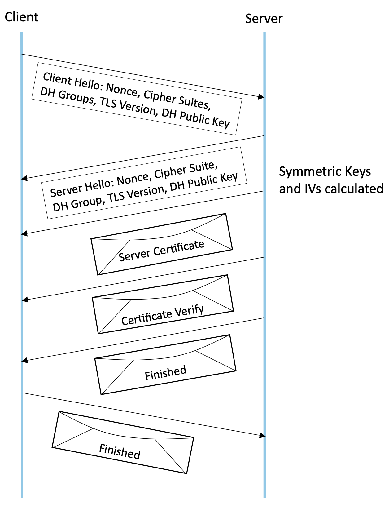
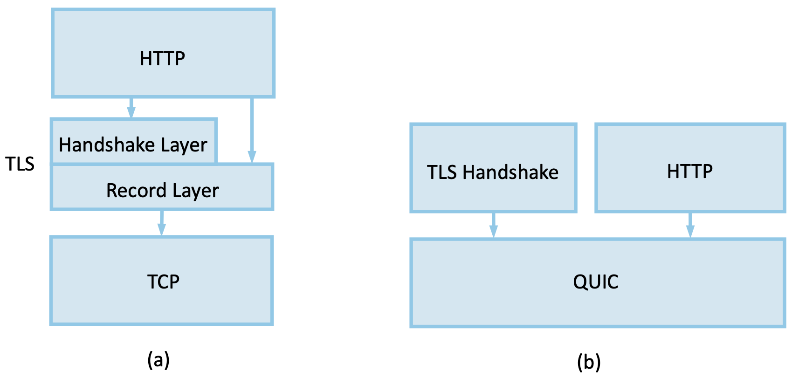

Chapter 6. Transport Security
=========================================

To understand the design goals and requirements for the Transport Layer
Security (TLS) standard and the Secure Socket Layer (SSL) on which TLS
is based, it is helpful to consider the main problems that they
were invented to solve. As the World Wide Web became popular and
commercial enterprises began to take an interest in it, it became clear
that some level of security would be necessary for transactions on the
Web. The canonical example of this is making purchases by credit card.
There are several issues of concern when sending your credit card
information to a computer on the Web. First, you might worry that the
information would be intercepted in transit and subsequently used to
make unauthorized purchases. You might also worry about the details of a
transaction being modified, such as changing the purchase amount. And
you would certainly like to know that the computer to which you are
sending your credit card information is in fact one belonging to the
vendor in question and not some other party. Thus, we immediately see a
need for confidentiality, integrity, and authentication in Web
transactions. The first widely used solution to this problem was SSL,
originally developed by Netscape and subsequently the basis for the
IETF’s TLS standard.

The designers of SSL and TLS recognized that these problems were not
specific to Web transactions (i.e., those using HTTP) and thus they built
a general-purpose protocol that sits between an application protocol
such as HTTP and a transport protocol such as TCP. The reason for
calling this “transport layer security” is that, from the application’s
perspective, this protocol layer looks just like a normal transport
protocol except for the fact that it is secure. That is, the sender can
open connections and deliver bytes for transmission, and the secure
transport layer will get them to the receiver with the necessary
confidentiality, integrity, and authentication. By running the secure
transport layer on top of TCP, all of the normal features of TCP
(reliability, flow control, congestion control, etc.) are also provided
to the application. This arrangement of protocol layers is depicted in
:numref:`Figure %s <fig-tls-stack>`.

.. _fig-tls-stack:
.. figure:: figures/f08-15-9780123850591.png
   :width: 300px
   :align: center

   Secure transport layer inserted between application and TCP layers.

When HTTP is used in this way, it is known as HTTPS (Secure HTTP). In
fact, HTTP itself is unchanged. It simply delivers data to and accepts
data from the SSL/TLS layer rather than TCP. For convenience, a default
TCP port has been assigned to HTTPS (443). That is, if you try to
connect to a server on TCP port 443, you will likely find yourself
talking to the SSL/TLS protocol, which will pass your data through to
HTTP provided all goes well with authentication and decryption. Although
standalone implementations of SSL/TLS are available, it is more common
for an implementation to be bundled with applications that need it,
primarily web browsers and servers.

The layered approach, inserting TLS between the application protocol
and the transport protocol, is not without drawbacks, particularly
when performance is considered. This eventually led to a rethinking
of the layering and a new transport protocol, QUIC, was developed with
the benefit of decades of experience with TLS and HTTP. We return to
this development below.

In the following discussion we focus
on TLS. SSL is now something of a historical artifact. TLS continues
to evolve as new weaknesses are identified and fixed, and new
cryptographic algorithms continue to be added, often replacing older
ones now considered insufficiently strong.

Like TCP, TLS has a setup phase involving handshakes followed by a connected
phase in which data is exchanged between the endpoints. We discuss
each in turn, beginning with the *handshake protocol* that supports
initial setup. Once the connection properties are established by the
handshake, the *record protocol* is used to protect the data sent
between the endpoints.

Performance is always important when applying cryptographic operations
to data transfers, and it has a significant impact on end-to-end
latency for web interactions. One performance-related design choice is
the use of symmetric key cryptography for the encryption and
authentication of data after the handshake is complete. In addition,
there have been efforts to reduce the number of round-trip
times required to begin data transfer, thus lowering initial latency.
We examine these developments later in this chapter.

6.1 Handshake Protocol
-----------------------

The main job of the handshake protocol is to allow a pair of TLS
participants to establish a shared secret key and negotiate at runtime
the set of cryptographic algorithms to use. It also allows for version
negotiation, so that, for example, a client running TLS version 1.2
can talk to a server that supports both version 1.2 and 1.3. It also
allows the client to authenticate the server, and, optionally, for
the client to be authenticated as well.

The handshake protocol needs to be resistant to man-in-the-middle
(MITM) attacks, which we discussed in Chapter 4. At one point in its
history, TLS version negotiation could be subverted by a MITM in such
a way that the client and server settled on a lower version than
necessary. Such a "downgrade attack" opens up the risk that old
vulnerabilities in the lower version, such as weak cryptographic
protocols, could be exploited.

TLS takes multiple precautions to increase its resistance against MITM
attacks. TLS 1.3 encrypts most of the handshake protocol, as early in
the process as possible. To facilitate this, the first step of the
handshake entails the establishment of a shared secret between the
client and the server. This is most commonly achieved using an
ephemeral Diffie-Hellman key exchange as described in Chapter
4. Pre-shared keys are also supported and have a role in restarting a
session quickly, as discussed in Section 6.3.

When we described Diffie-Hellman in chapter 4 we explained the original
algorithm that operates on groups of integers using modular
arithmetic. This is now known as Finite Field Diffie-Hellman. It is
also possible to use elliptic curves rather than modular arithmetic
and both options are available in modern TLS.

There are a number of ways the handshake protocol can play out, but
a typical set of operations is as follows:

1. The client sends a "client hello" message which specifies which
   Diffie-Hellman groups or elliptic curves it supports, along with an
   ephemeral Diffie-Hellman key for each group/curve. The hello also
   contains a nonce, the set of cipher suites that the client can use
   for subsequent encryption and authentication, and the TLS version
   the client supports.

2. The server replies with a "server hello" message indicating which
   Diffie-Hellman group or curve it has chosen and a corresponding
   ephemeral Diffie-Hellman public key. The hello also states which
   TLS version the server supports, the cipher suite it has chosen
   among those offered by the client, and a nonce.

Recall that a simple Diffie-Hellman key exchange is not secure against
MITM attacks, and the remaining steps in the handshake protect against
this. From the first two messages, the server and the client are able
to agree on a shared secret using one of several Diffie-Hellman
algorithms. A choice of groups or curves were provided in the client
hello, and one of them has been selected by the server. Similarly, one
of the offered cipher suites has been selected. With Diffie-Hellman
allowing them to obtain a shared secret, all subsequent messages
between client and server will be encrypted. But we still have to rule
out the MITM attack.

3. The server now sends one or more certificates. In the simplest
   case, there is a single certificate signed by a certification
   authority (CA) that is trusted by the client.

4. The server sends a "certificate verify" message, which proves that
   the server has the private key that corresponds to the public key
   in the previously supplied certificate. The signature covers
   everything that has been sent in the handshake up to this point,
   which includes a pair of nonces, thus providing protection against
   replay attacks. And the signature along with the certificate is
   sufficient to prove to the client that it is talking to the
   intended server, not to some attacker in the middle, who would be
   unable to provide the signature.

5. The server sends a "handshake finished" message which contains a
   hash of everything sent so far, ensuring that nothing in the
   handshake was tampered with. This further protects against MITM attacks.

6. The client sends a similar "handshake finished" message.

At this point the client knows that it is talking to the intended
server, and both parties know that they have successfully completed the
handshake without any tampering of messages. The server in this case
does not know who the client is because there has been no client
authentication. TLS does support client authentication using client
certificates, but it is not the norm in today's Internet for clients
to authenticate in this way.

..   Something about compatibility with 1.2 middleboxes

Recall that public key cryptography is computationally more expensive
than symmetric key cryptography, so we limit the use of public key
operations to the handshake protocol. And when we said above that all
the messages after the first two are encrypted, this is done using
symmetric keys. The roles of public keys in TLS are (a) the
Diffie-Hellman key exchange (b) the use of certificates to
authenticate servers and, optionally, clients. All of that is limited
to the handshake protocol.

:numref:`Figure %s <fig-tls-hand>` shows the handshake protocol at a
high level.  When the client and server have each received a
"handshake finished" message from their respective peer, the handshake
is complete and application data can start to flow.

.. _fig-tls-hand:

   Handshake protocol to establish TLS session.

Encryption of data between client and server is performed by TLS’s
*record protocol*. Because the handshake protocol in TLS 1.3 requires
encryption after the first two messages, the record protocol actually
comes into play at step 3 above, even before we get to sending any
application data. We discuss the details of the record protocol below.

6.2 Record Protocol
--------------------

The task of the record protocol is to protect the data that is sent
over a TLS connection with both encryption and authentication.
While TLS supports a wide range of encryption and authentication
methods, the set of options has actually become narrower in version
1.3 as weaknesses of older methods became clear and new cryptographic
algorithms have emerged. All the algorithms in TLS 1.3 provide both
encryption and authentication in a single cipher suite, using the
technique known as authenticated encryption with additional data
(AEAD) which was discussed in Chapter 3.

In TLS, the cipher that provides authentication and encryption uses
two keys, one for each direction. Similarly, two initialization
vectors are required.  Thus, regardless of the choice of cipher suite,
a TLS session requires effectively four keys to be agreed upon by the
end points. TLS derives all of them from a single shared secret that
was obtained during the handshake phase.

The step that derives the keys and initialization vectors from the
shared secret is called the "HMAC-based extract-and-expand key
derivation function (HKDF)". The goal is to produce enough keying
material for the record layer–two IVs and two symmetric keys of
appropriate length–and to do so in such a way that an attacker has no
better way of guessing them than a brute force attack. In other words,
we want the keys and IVs to be as close to random as possible. This is
a bit harder than it might first appear, because the shared secret
that is obtained via Diffie Hellman, which is our starting point, is
not itself completely random. The reason for this may not be obvious,
but the goal of the various Diffie Hellman algorithms is to generate a
shared secret, not that such secrets be randomly distributed.

There is some fairly serious mathematics underlying HKDF, but the
basic idea is called "extract and expand". The first step is to
"extract" the randomness from the shared secret. This is done by
calculating a HMAC (hash-based message authentication code, as described
in Chapter 3) over the shared secret. The resulting pseudorandom key
is input to the next stage, along with an additional source of
randomness: the hash of everything contained in the initial
handshake. Note that the handshake messages include two random
nonces. The "expand" step then applies the HMAC function using these
inputs and HMAC is reapplied as many times as needed to produce the
required amount of key and IV material.

When all the keys and IVs are available to client and server, the record
layer can now protect the underlying data with encryption and
authentication. The record layer also handles fragmentation and
reassembly–breaking the incoming stream of plaintext into chunks of up
to 2\ :sup:`14` bytes.

To encrypt one block for transmission, the record layer takes as input
the encryption key, a nonce (which we explain below), the plaintext to
be encrypted, and "additional data" to be authenticated but not
encrypted. This additional data is the header for the record layer,
indicating the type of data being encrypted (e.g., application data or
handshake data) and its length. The nonce is calculated by computing
the XOR of the IV and a sequence number that increments with every
block. The AEAD cipher then computes the ciphertext that will follow
the record header, and the resulting block is passed to the transport
layer (normally TCP) for transmission.

On the receiving side, the process runs in the other direction, with
the appropriate key, nonce, ciphertext and additional data (headers)
being passed to the AEAD decryption function. If authentication is
successful, the plaintext is recovered and can be passed up to the
application. If authentication does not succeed, the connection is
terminated and an alert is generated.

6.3 Session Resumption and Zero RTT Operation
----------------------------------------------

In our initial description of the TLS handshake, we described how
Diffie-Hellman is used to established a shared secret, but noted
that the option also exists to use a pre-shared key (PSK). While
out-of-band provisioning of a PSK is possible, a much more common use
of a PSK is to allow session resumption, thus removing the need to go
through another Diffie-Hellman exchange.

An important side-effect of using a pre-shared key is that it becomes
possible to start sending data earlier in the process. This operation
is referred to as "0-RTT Data" because it is possible to start sending
application data along with the handshake material without waiting for
the round trip time of the handshake to elapse. This is an important
step in improving the latency of HTTPS connection establishment and
thus the user experience when browsing the Web.

The idea of session resumption predates TLS 1.3 but it has evolved
somewhat to become more secure. In TLS 1.3, the server may create a
*session ticket* after the completion of the handshake process. The ticket
contains an opaque identifier of the session and a ticket lifetime (as
well as some other fields). The ticket is sent after the handshake
which means it is encrypted much like application data. More than one
ticket can be sent.

A ticket is effectively a label for a previously established
session, which has a shared secret already. When a client
connects to a server to which it was previously connected, it can look
at its stored tickets and, if there are any that have not expired, it
can include one in the first message of a handshake. Along
with the ticket, the client includes something called a "binding",
which is a HMAC calculated over the current handshake message using a
key derived from the *previous* handshake. The effect of this binding
is to tie the new handshake back to the old one, since only a client
that successfully completed the prior handshake can have the key
required to calculate the HMAC. Thus, while an attacker might snoop on
the ticket, it can't do much with it and any attempt to modify the new
handshake message will fail.

When the server sees that the client has sent a ticket, it validates
the binding, and if the HMAC calculation succeeds, then the server and
client now have agreement that they can use a shared secret
established in the prior session. They use a "resumption master
secret" that was calculated and stored in the prior session to derive
a new set of keys for this session. The keys of the new
session are different from those of the prior session to support
forward secrecy (i.e., an attacker who learns the key for session N
doesn't immediately have the keys for session N+1).

When the server sends its "Finished" message, it calculates the HMAC
over the handshake messages using the agreed-upon new key, and thus
authenticates itself to the client.

On its own, session resumption as just described may not seem that
interesting. It avoids the need for another Diffie-Hellman exchange
but is still requires a round trip time to establish the session. But
because the new session keys are known to both sides before the first
handshake message is sent, session resumption opens up the possibility
of sending "0-RTT data" along with the handshake. 0-RTT data can be
included along with the handshake messages, without waiting one RTT
for keys to be established. This is beneficial from a performance
perspective, especially for short-lived connections, but it comes with
some downsides in terms of security.

There are two main drawbacks to 0-RTT data. The first is that it is
prone to replay attacks in a way that other data transfers are not. If
an attacker can sit between a client and a server, they have the
opportunity to replay 0-RTT data. Exactly how much damage this does is
very much application dependent, so the TLS specifications dictate
that (a) 0-RTT data can only be sent when the application layer
explicitly requests it, i.e., it can't just be an optimization
provided by the socket layer (b) the application must know how to deal
with replays of data sent as 0-RTT, e.g., by only sending 0-RTT
data for operations that are idempotent.

The other drawback of 0-RTT data is that it depends on keys that are
derived from secrets used in an earlier transaction. If those secrets
were somehow compromised, the attacker would have the necessary
information to compromise the new session. Thus, 0-RTT data lacks
forward secrecy. For this reason, the option exists to generate a new
set of keys as part of the session resumption handshake with a new
Diffie-Hellman exchange. This means that only the data sent in the
first RTT lacks forward secrecy, and the rest of the session is
protected by the new, uncompromised keys.

All of this work to reduce the setup time of TLS by a single RTT might
seem surprising, but in fact the history of HTTP and HTTPS over TCP is
full of issues with excessive setup times. The very first
implementations of HTTP were quite wasteful of TCP connections,
setting up a new connection for every object on a requested web
page. The history of HTTP over TCP and the addition of TLS is full of
efforts to reduce the latency since the most simple approaches just
layered one handshake on top of another. The next step in the process
of reducing the latency of TLS session establishment involves
rethinking the choice of TCP as the underlying transport, as we
discuss below.

6.4 QUIC, HTTP/3 and TLS
------------------------

Since the invention of the World Wide Web in the 1990s, HTTP has run
over TCP. HTTP/1.0, the original version, had quite a number of
performance problems due to the way it used TCP, such as the fact that
every request for an object required a new TCP connection to be set up
and then closed after the reply was returned. HTTP/1.1 was proposed at
an early stage to make better use of TCP. TCP continued to be the
protocol used by HTTP for another twenty-plus years.

Adding security to HTTP-over-TCP in the form of SSL and TLS further
exacerbated performance issues, even as advancements to HTTP mitigated
some of the original problems. As noted in the preceding section, it
takes at least one round trip time to establish a secure TLS
session. The relatively recent introduction of 0-RTT data reduces the
latency before the first data can be sent; it also comes with some
security drawbacks as we observed above.

Of course, the time required to set up a secure session with TLS in
*in addition* to the time need to set up a TCP connection. TCP needs
to complete its 3-way handshake before the first TLS handshake
message-which is just data as far as TCP is concerned-can be sent. So
the sequence of events was:

- Client initiates TCP 3-way handshake to establish TCP session.

- TLS handshake establishes security parameters for client-server
  communication.

- First HTTP message gets sent from client to server.

In other words, in the original TLS-over-TCP model it would take at
least three RTTs to get a response to a single HTTPS request. In fact
up until TLS 1.3 arrived it was at least four RTTs due to the use of
two RTTs to complete the TLS handshake.

This is not the only problem with running HTTP over TCP. A reliable,
ordered byte stream as provided by TCP isn't exactly the right model
for Web traffic. In particular, since most web pages contain many
objects, it makes sense to be able to request many objects in
parallel, but TCP only provides a single byte stream. If one packet is
lost, TCP waits for its retransmission and successful delivery before
continuing, while HTTP would have been happy to receive other objects
that were not affected by that single lost packet. Opening multiple
TCP connections would appear to be a solution to this, but that has
its own set of drawbacks including a lack of shared information about
congestion across connections.

Other factors such as the rise of high-latency wireless networks and
the availability of multiple networks for a single device (e.g., Wi-Fi
and cellular) contributed to the realization that the transport layer
for HTTP would benefit from a new approach. The protocol that emerged
to fill this need was QUIC.

In this section we will focus on how QUIC particularly improves the
performance of TLS compared to running over TCP. QUIC is quite a
comprehensive re-working of the transport layer that could fill its
own book-indeed the set of RFCs that define it run to the hundreds of
pages.

QUIC originated at Google in 2012 and was subsequently developed as a
proposed standard at the IETF. It has already seen a solid amount of
deployment—it is in most Web browsers, many popular websites, and is
even starting to be used for non-HTTP applications. Deployability was
a key consideration for the designers of the protocol. There are a lot
of moving parts to QUIC—its specification spans three RFCs—but we
focus here on how it changes the relationship between TLS and the
underlying transport.

The single most important change in QUIC from the perspective of TLS
performance is that it doesn't treat the transport and security
handshakes as two distinct layers. Instead, QUIC has build a
cryptographic handshake based on TLS into the transport. This is
illustrated by Figure foo. As RFC 9001 puts it:

*Rather than a strict layering, these two protocols cooperate: QUIC
uses the TLS handshake; TLS uses the reliability, ordered delivery,
and record layer provided by QUIC.*

.. _fig-quic-tls:

   Protocol stacks compared. (a) HTTP over TLS over TCP. (b) HTTP and
   TLS Handshake over QUIC.

This rearrangement of layers takes a bit of work to understand. The
central idea is that QUIC has the ability to provide encryption and
authentication to the data it transmits once it has a set of keys to
work with. So the TLS handshake operates pretty much as it did over
TCP, but instead of wrapping up TLS handshake messages in the TLS
record layer before sending them out over TCP, we can send the TLS
handshake messages over QUIC directly. QUIC also provides the
reliability, congestion control, etc. that TCP provides. Once the TLS
handshake is complete, the keying material for the connection is
passed to QUIC, which now is able to encrypt and authenticate the data
that is sent by HTTP.

The most obvious practical impact of this is that the establishment of
a QUIC connection takes place at the same time as the transmission of TLS
handshake messages, rather than taking place prior to the TLS
handshake as with TCP. By the time the TLS handshake completes, the
two ends of the QUIC connection have all the state needed to transmit
data such as HTTP messages. Furthermore, in the cases where 0-RTT data
can be sent (because there are shared secrets cached from a
previous connection), the first HTTP request can actually be sent at
the same time as the client Hello message.

A final detail of note is that QUIC runs on top of UDP rather than
directly over IP. The reason behind this is that there are plenty of
middleboxes in the Internet that assume that the only acceptable
transport protocols are TCP and UDP and block anything else. So while
UDP doesn't add much in the way of useful functionality to QUIC, it
was an expedient step to run QUIC over UDP to ease deployment
of QUIC in the Internet.

QUIC is an interesting development in the world of transport protocols
and not just for its impact on security. Many of the limitations of
TCP have been known for decades, but QUIC represents one of the most
successful efforts to date to stake out a different point in the
design space. Because QUIC was inspired by experience with HTTP, TLS,
and the Web—which arose long after TCP was well established in the
Internet—it presents a fascinating case study in the unforeseen
consequences of layered designs and in the evolution of the
Internet. There is a lot more to it that we can cover here. The
definitive reference for QUIC is RFC 9000, while RFC 9001 covers the
relationship of TLS to QUIC. A more readable overview of the
protocol's design and deployment appears in the following paper from
SIGCOMM 2017.

.. _reading_quic:
.. admonition::  Further Reading

   A. Langley *et al.*
   `The QUIC Transport Protocol: Design and Internet-Scale Deployment
   <https://doi.org/10.1145/3098822.3098842>`__.
   Proc. ACM SIGCOMM, August 2017.

   L. Peterson, L. Brakmo, and B. Davie, `TCP Congestion Control: A
   Systems Approach
   <https://tcpcc.systemsapproach.org/variants.html#http-performance-quic>`__.

6.5 A Systems View of TLS
------------------------------

When we talk about "The Systems Approach", we always come back to the
need to consider how all the parts of a system interact with each
other to form a coherent whole, rather than just looking at single
components in isolation. For example, TLS is a system that includes
both public-key and symmetric-key cryptography, authentication and
privacy mechanisms, certification authorities, and sub-layers such as
the record protocol and the handshake protocol. But the systems
approach applies recursively too. As we have already seen, it is
important to look at how TLS sits within the overall protocol stack,
with HTTP and other applications above it, and a choice of transport
layer protocols (TCP and QUIC) below it. The interactions among these
layers have proven critical to the performance of the World Wide Web
and other applications that run over HTTPS.

We can take yet another step back and consider a broader system that
includes end users, their browsers, and the servers that make up the
World Wide Web. For most users, the only indication that TLS is being
used when they browse the Web is a little padlock icon next to the URL
in the browser's address bar. Over the decades that SSL and TLS have
been in use, the browser companies have, with some success, educated
users to expect encrypted connections to most web sites, particularly
when data is being sent by the user. If a user tries to send data
(e.g., by filling out a form) over an unencrypted HTTP connection, the
browser pops up a warning about the risk of doing so. If a certificate
has expired or does not match the URL of the site being browsed,
another warning is presented. Users can generally choose to override
these warnings but the overall effect is to reinforce behaviors that
are more secure and discourage those that are insecure.

Certification authorities are a critical part of this overall
system. Most users have no way to determine whether any given CA does
its job properly. As discussed in Chapter 4, the way that CA
hierarchies work means that a lot of trust is placed at the top-level
CAs. These are the CAs that are trusted by default in browsers; if
they trust lower-level CAs that are not doing a good job of verifying
the legitimacy of organizations to whom they issue certificates, it
creates weaknesses in the overall CA system that can be exploited.

An important development in the deployment of TLS was the creation of
Let's Encrypt, a CA run by a non-profit that provides TLS certificates
at no charge. By making certificates free for web sites, Let's
Encrypt helped advance the cause of making encrypted connections on
the Web the default. Prior to the establishment of Let's Encrypt, it
was typical for sites to pay for a certificate from a CA, and the cost
was non-trivial for small sites. Let's Encrypt issues
*domain-validated certificates*. Issuance of these certificates can be
fully automated and depends on the domain implementing a
challenge-response protocol known as ACME (Automated Certificate
Management Environment). We won't dwell on the details here, but the
availability of certificates that are both free and automatically
issued and renewed has dramatically increased the adoption of
HTTPS. This in turn helps with setting user expectations that a
padlock should be present in their browser's address bar, even if they
have no understanding of what is going on under the covers.

More detail on Let's Encrypt can be found in the following paper.

.. _reading_encrypt:
.. admonition::  Further Reading

   J. Aas *et al.*
   `Let's Encrypt: An Automated Certificate Authority to Encrypt the Entire Web
   <https://dl.acm.org/doi/10.1145/3319535.3363192/>`__.
   SIGSAC 2019.

One area that remains challenging for end users is the ability of
malicious actors to create sites that look legitimate and use URLs
that are similar enough to the original to fool users. This might be
done using easily missed spelling errors (accoounts-google.com being
one infamous example). An encrypted connection is of no value to the end
user if they are being connected to a malicious site. In
Chapter 9 we take a look at passkeys as part of the solution to the
problem of phishing attacks that steer users to such sites. Again, the
system that we are trying to protect is more than just a connection
from a browser to a web site.

One conclusion to draw from this discussion is that we need to take a
broad view of the "systems" that we are trying to secure, and the way
that users interact with the system are critical to its success. It's
also worth recalling some of the points from earlier in the book: any
analysis of security should start by looking at the threats that we
need to protect against. And there are always going to be trade-offs
between the costs we are willing to pay and the security we can
provide. TLS is not a perfect of complete solution but it has
certainly done a lot to improve security of communication on the
Internet.

.. consider a reference on Let's Encrypt, anything else?
